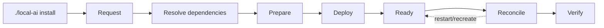

# Installer internals

The common installer resolves dependency order from manifests and lifecycle commands from `installer/lifecycle.json`. It must remain generic: stack-specific behaviour belongs to the stack, not to the installer.

`installer/`, `install.py` and stack lifecycle scripts are **internal implementation details**. Operators and external integrations use `./local-ai` only; see [ADR-0002](../adr/0002-single-management-cli.md).



## Contracts

- `.lock` means PREPARED only.
- Planning is read-only.
- PREPARE may create owned runtime/configuration but must not rewrite the central `.env` as a hidden side effect.
- Required dependencies are installed before their consumer.
- A healthy running stack is not automatically considered converged with tracked source.
- Upgrade intent belongs to the installation-local upgrade plan and is managed through `./local-ai upgrade ...`.

## Supported operator commands

```bash
./local-ai install --plan all
./local-ai install --plan 7
./local-ai install 7 --yes
./local-ai install 7 --reconcile --yes
```

Direct invocation of internal Python/shell files is permitted for development tests but is not a supported external contract.

The full operator flow is documented in [../docs/installation.md](../docs/installation.md). Automated contracts live only under [../tests/](../tests/).
