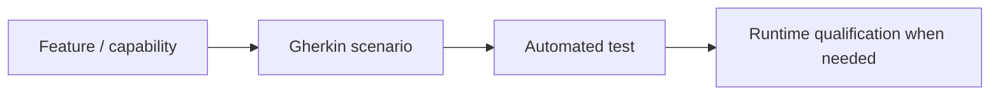

# OpenSpec — simplified project behaviour contract

This is intentionally small. It does not reproduce the full OpenSpec process or create a second project-management system.

The contract is:

Each scenario uses a stable tag such as `@DR-BACKUP-001`. Tests should reuse that identifier whenever practical. A scenario describes externally meaningful behaviour, not implementation detail.

Rules:

1. Specify behaviour that matters to an operator, user, recovery process or security boundary.
2. Prefer one scenario to one test contract; several low-level unit tests may support one scenario.
3. Do not duplicate manifests, Compose or source code in prose.
4. Runtime-only qualifications may be referenced when they cannot be reproduced safely in unit tests.
5. Changes that alter a contract update Gherkin and tests together.
