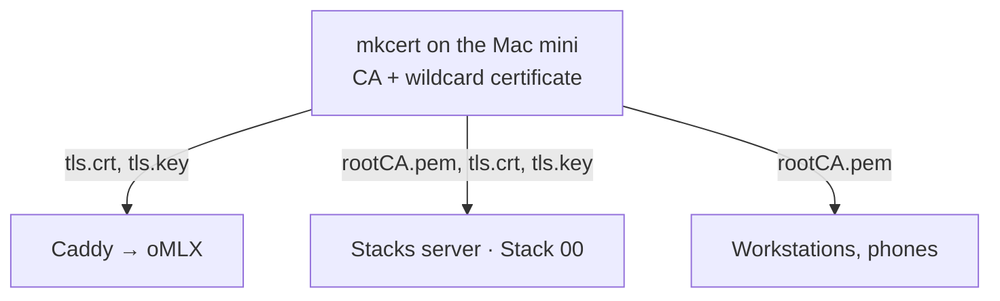

<!--
This Source Code Form is subject to the terms of the Mozilla Public
License, v. 2.0. If a copy of the MPL was not distributed with this
file, You can obtain one at https://mozilla.org/MPL/2.0/.
-->

# Program configs

Setup guides for the hosts around the stacks server. Nothing here is installed by `./local-ai`.

| Host | Guide | Content |
| --- | --- | --- |
| Mac mini | [oMLX](inference_server/omlx/README.md) | Headless oMLX runbook and its installer `install.omlx-headless.sh` |
| Mac mini | [mkcert](inference_server/mkcert/README.md) | Create the local CA and the wildcard certificate |
| Mac mini | [Caddy](inference_server/caddy/README.md) | TLS in front of oMLX (`Caddyfile`) |
| Stacks server and clients | [Root CA installation](stacks_server/root-ca_install/README.md) | Trust `rootCA.pem` on Linux, macOS, iOS, and other clients |
| Workstations | [opencode](workstations/opencode/opencode.jsonc) | opencode configured for LiteLLM; put your key in `~/.config/opencode/litellm.key` |
| Workstations | [Syncthing](workstations/syncthing/README.md) | Sync an Obsidian vault with the server |
