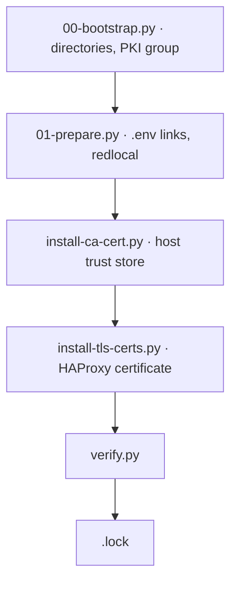

<!--
This Source Code Form is subject to the terms of the Mozilla Public
License, v. 2.0. If a copy of the MPL was not distributed with this
file, You can obtain one at https://mozilla.org/MPL/2.0/.
-->

# Stack 00 — Platform

[Operations](../docs/operations.md) · [All stacks](../README.md#stacks)

Prepares the host for every other stack. It has no containers.



`./local-ai stack-00 install` runs `install.py`, which executes the phases above in order. Every phase checks before it changes anything.

| | |
| --- | --- |
| Install requires | `.env` (`root:root 0600`); certificate source files only if certificates are missing or being rotated |
| Creates | `${BASE_PATH}/service_-_platform`, `service_-_haproxy/config`, `service_-_web` · group `local-hybrid-pki` · network `redlocal` · links `stack-NN_-_*/.env → ../.env` · CA in `/usr/local/share/ca-certificates/` · `tls.crt`/`tls.key` for HAProxy |
| `status` | `.lock` only; `--deep` runs `verify.py` |

## Behaviour that differs from other stacks

- **`install` always audits.** An existing `.lock` does not skip it. Missing or invalid state is repaired, valid state is kept, and the `.lock` is (re)written only after `verify.py` passes. A failed phase removes the `.lock`.
- **Valid certificates are kept.** The source files in `LOCAL_CA_SOURCE_PATH`, `TLS_CERT_SOURCE_PATH`, and `TLS_KEY_SOURCE_PATH` are read only when the installed material is missing or invalid. The scripts never delete those source files.
- **Application directories.** Each application stack creates its own directories during its `install` (`00-bootstrap.py --stack NN`). Running `00-bootstrap.py` without `--platform-only` or `--stack` visits every unlocked stack, so use `--dry-run` first.

## Certificates

The CA and the wildcard certificate are created with mkcert on the Mac mini ([mkcert guide](../program_configs/inference_server/mkcert/README.md)). `tls.crt` must cover every name in `TLS_SAN_DOMAINS`. `tls.key` is installed as `root:local-hybrid-pki 0640`, so HAProxy (uid 99) can read it through that group.

To rotate, copy the new files to the configured source paths, then:

```bash
cd stack-00_-_platform
./install-tls-certs.py --renew        # or ./install-ca-cert.py --force for a new CA
cd ../stack-10_-_haproxy_web && docker compose restart haproxy
```

## Files

| File | Role |
| --- | --- |
| `install.py` | Runs all phases and writes `.lock` |
| `00-bootstrap.py` | Service directories and PKI group (`--platform-only`, `--stack NN`, `--dry-run`) |
| `01-prepare.py` | `.env` links and `redlocal` network; never overwrites a non-link `.env` |
| `install-ca-cert.py` | CA into the host trust store (`--ca`, `--force`) |
| `install-tls-certs.py` | Validated TLS pair for HAProxy (`--cert`, `--key`, `--ca`, `--renew`) |
| `verify.py` | Read-only check of everything above |

Owners and modes of every runtime directory are defined in `build_layout()` in `00-bootstrap.py`. Variables are documented in the "00" section of [`.env.template`](../.env.template).
