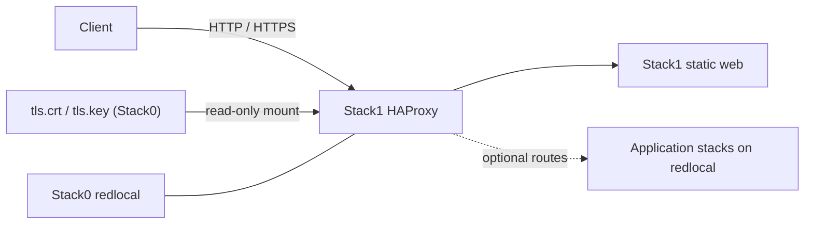

<!--
This Source Code Form is subject to the terms of the Mozilla Public
License, v. 2.0. If a copy of the MPL was not distributed with this
file, You can obtain one at https://mozilla.org/MPL/2.0/.
-->

# Stack 10 — HAProxy + Web

[Stack operations](../docs/operations.md) · [All stacks](../README.md#stacks-and-dependencies)

Stack1 owns the platform HTTP/HTTPS ingress and the small static landing page. Application backends remain owned by their own stacks; Stack1 only publishes selected services.

## Contract

- **Requires:** Stack0.
- **Provides:** ingress/web publication capability.
- **Owns:** `haproxy` and `web` containers plus their Stack1 runtime directories.
- **DR:** reconstructable; Stack1 has no durable recovery artifact.
- **Security boundary:** application backends should normally remain internal to `redlocal` instead of publishing host ports directly.

Stack0 owns `redlocal`, the service directories (`00-bootstrap.py`) and the TLS material: `install-tls-certs.py` installs the mkcert wildcard certificate as `tls.crt` / `tls.key` in `${BASE_PATH}/service_-_haproxy/config`. Stack1's `01-prepare.py` only verifies that pair and places `haproxy.cfg` next to it; that directory is mounted read-only as `/usr/local/etc/haproxy`. Stack1 never creates, renews or replaces certificates.

## Runtime behaviour

HAProxy is deliberately tolerant of optional backends. A backend that is absent or temporarily unavailable must not prevent Stack1 itself from starting. This allows stacks to remain independently deployable while sharing one ingress layer.

Updating a file on disk does not necessarily reload the HAProxy process. Configuration, mount, group or certificate changes require a deliberate reload or recreation; `start` does not guarantee that an already-running container reloads changed files.

`.lock` means **PREPARED only**. It does not mean HAProxy is running, healthy or serving every optional backend.

## Unattended preparation wrapper

Run `python3 -B wrapper/bin/stack-10.py install` from the repository root (as root for
initial preparation). The wrapper calls the stack's Python package without
interactive input, forwards the preparation output, and checks both its exit
status and the resulting `.lock`. `install` never starts or restarts containers.

When `.lock` already exists, the wrapper changes nothing and explains the
reconfiguration risk. It does not remove the lock. After a successful
preparation, it prints the manual `docker compose ... up -d` command; running
that command remains a separate operator decision.

`python3 -B wrapper/bin/stack-10.py start` runs `docker compose up -d` for HAProxy and web after checking the preparation lock. `python3 -B wrapper/bin/stack-10.py stop` runs `docker compose down` without `--volumes`: it removes the containers but retains Stack0's external network, service files and `.lock`. Neither verb verifies endpoint readiness or renews TLS; Stack0 owns certificates.

Run both lifecycle verbs as root; `stop` remains available if `.lock` is missing.

`python3 -B wrapper/bin/stack-10.py status` reads Compose container state and health without changing anything. HAProxy's healthcheck validates its mounted configuration, while the BusyBox web check fetches its local homepage. HAProxy health does not prove that every optional upstream or public TLS route works. `status --deep` currently has no additional probe.

## Security invariants

- `tls.key` is installed by Stack0 as `root:PLATFORM_PKI_GID 0640`; HAProxy (uid 99) reads it only through that supplementary group. Stack1 never copies or rewrites it.
- Backend services stay on `redlocal` unless an explicit architecture decision publishes them.
- Stack1 does not become owner of application state merely because it exposes an application route.
- The operator entry point is `wrapper/bin/stack-10.py`; certificate rotation remains a Stack 00 task.

Key implementation files: `docker-compose.yml`, `config/haproxy/haproxy.cfg`, and `01-prepare.py`.
