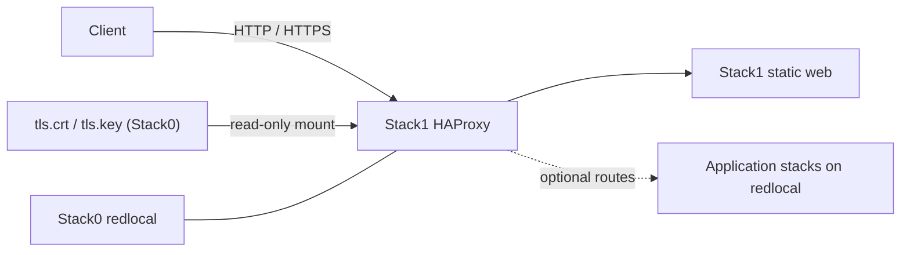

<!--
This Source Code Form is subject to the terms of the Mozilla Public
License, v. 2.0. If a copy of the MPL was not distributed with this
file, You can obtain one at https://mozilla.org/MPL/2.0/.
-->

# Stack1 — HAProxy + Web

[Documentation TOC](../docs/TOC.md) · [Stack map](../docs/stacks/README.md) · [OpenSpec contract](../docs/devel-docs/openspec/stacks/stack1.feature)

Stack1 owns the platform HTTP/HTTPS ingress and the small static landing page. Application backends remain owned by their own stacks; Stack1 only publishes selected services.

## Contract

- **Requires:** Stack0.
- **Provides:** ingress/web publication capability.
- **Owns:** `haproxy` and `web` containers plus their Stack1 runtime directories.
- **DR:** reconstructable; Stack1 has no durable recovery artifact.
- **Security boundary:** application backends should normally remain internal to `redlocal` instead of publishing host ports directly.

Stack0 owns `redlocal`, the service directories (`00-bootstrap.py`) and the TLS material: `install-tls-certs.py` installs the mkcert wildcard certificate as `tls.crt` / `tls.key` in `${BASE_PATH}/service_-_haproxy/config`. Stack1's `01-prepare.py` only verifies that pair and places `haproxy.cfg` next to it; that directory is mounted read-only as `/usr/local/etc/haproxy`. Stack1 never creates, renews or replaces certificates.

## Runtime behaviour

HAProxy is deliberately tolerant of optional backends. A backend that is absent or temporarily unavailable must not prevent Stack1 itself from starting. This allows stacks to remain independently deployable while sharing one ingress layer.

Updating a file on disk does not necessarily reload the HAProxy process. Configuration, mount, group or certificate changes require controlled lifecycle convergence through `./local-ai`; direct Compose operations are implementation details, not the supported operator contract.

`.lock` means **PREPARED only**. It does not mean HAProxy is running, healthy or serving every optional backend.

## Security invariants

- `tls.key` is installed by Stack0 as `root:PLATFORM_PKI_GID 0640`; HAProxy (uid 99) reads it only through that supplementary group. Stack1 never copies or rewrites it.
- Backend services stay on `redlocal` unless an explicit architecture decision publishes them.
- Stack1 does not become owner of application state merely because it exposes an application route.
- The supported operator boundary is `./local-ai`; stack scripts and Compose files remain private implementation surfaces.

## Related decisions

- [ADR-0002 — single management CLI](../docs/devel-docs/adr/0002-single-management-cli.md)
- [SDR-0004 — internal-only service networking](../docs/devel-docs/sdr/0004-internal-only-service-networking.md)
- [Configuration and secrets](../docs/configuration/env-secrets.md)

Key implementation files: `docker-compose.yml`, `config/haproxy/haproxy.cfg`, `manifest.json`, and the stack-owned lifecycle scripts.
