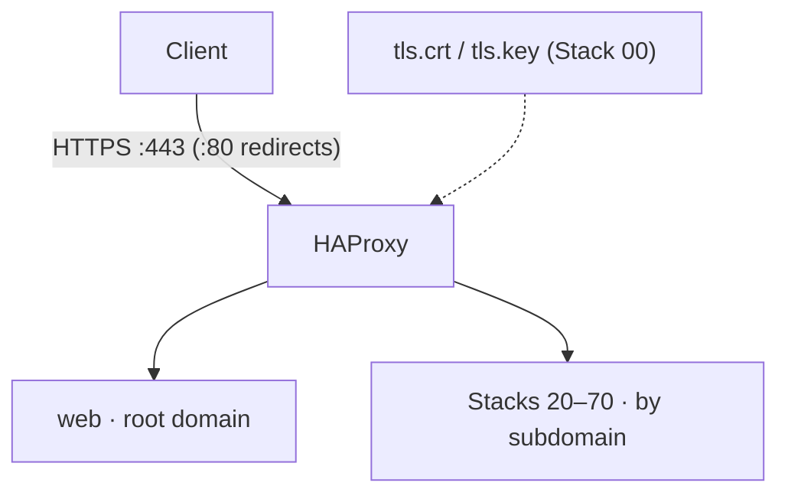

<!--
This Source Code Form is subject to the terms of the Mozilla Public
License, v. 2.0. If a copy of the MPL was not distributed with this
file, You can obtain one at https://mozilla.org/MPL/2.0/.
-->

# Stack 10 — HAProxy + Web

[Reading guide](../README.md#reading-guide) · [Operations](../docs/operations.md) · Next: [Stack 30 · LiteLLM](../stack-30_-_litellm/README.md)

The single HTTPS entry point. HAProxy terminates TLS and routes each host name to its stack over `redlocal`. A small static page answers on the root domain.

| | |
| --- | --- |
| Install requires | Stack 00 |
| Containers | `haproxy`, `web` (Compose project `Stack1 - HAProxy + Web`) |
| Ports | host `HAPROXY_HTTP_PORT` (80) and `HAPROXY_HTTPS_PORT` (443) |
| Runtime data | `${BASE_PATH}/service_-_haproxy/config` (`haproxy.cfg` next to the TLS pair), `service_-_web` |
| `status` | `haproxy -c` config check; `web` homepage fetch |

The routing table is in the [main README](../README.md#architecture). Host names and backend targets come from `.env` (`*_HOSTNAME`, `*_TARGET`).

## Notes

- **Missing backends are tolerated.** HAProxy starts even if a routed stack is down; that route fails until the backend appears.
- **`reconfig` stages managed HAProxy and web files.** It validates Compose, backs up changed runtime files, and never changes container state. Apply staged changes with `./local-ai stack-10 stop` and `./local-ai stack-10 start`. Certificate rotation remains a Stack 00 operation.
- **Certificates belong to Stack 00.** `01-prepare.py` checks the TLS pair but never creates or replaces it.
- **Keep backends private.** Application stacks should publish through HAProxy, not through their own host ports. The one exception is Gitea SSH.

Files: `docker-compose.yml`, `config/haproxy/haproxy.cfg`, `config/web/index.html`, `01-prepare.py`.
