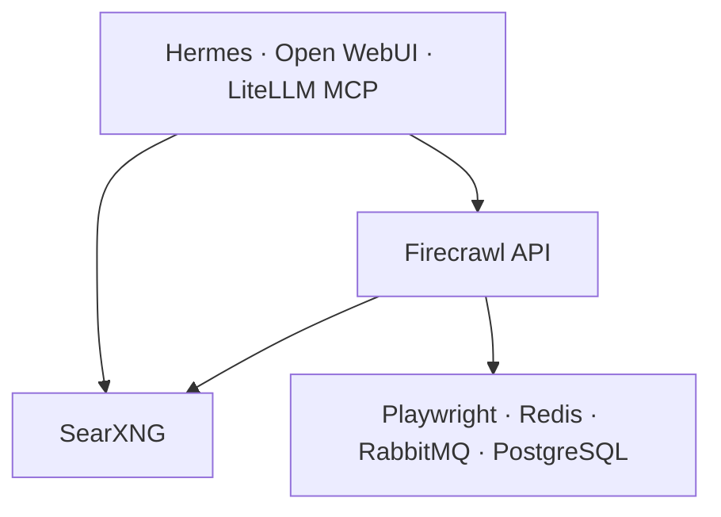

<!--
This Source Code Form is subject to the terms of the Mozilla Public
License, v. 2.0. If a copy of the MPL was not distributed with this
file, You can obtain one at https://mozilla.org/MPL/2.0/.
-->

# Stack 20 — SearXNG + Firecrawl

[Reading guide](../README.md#reading-guide) · [Operations](../docs/operations.md) · Next: [Stack 40 · Gitea](../stack-40_-_gitea/README.md)

Local web search (SearXNG) and page extraction (Firecrawl), also exposed as MCP servers. It is optional: without it, consumers keep web tools disabled rather than falling back to an external service.

| | |
| --- | --- |
| Install requires | Stack 00; `FIRECRAWL_POSTGRES_ADMIN_PASSWORD` in `.env` (from `env bootstrap`) |
| Containers | `searxng`, `searxng-mcp`, `firecrawl-mcp`, `firecrawl-api`, `firecrawl-playwright`, `firecrawl-redis`, `firecrawl-rabbitmq`, `firecrawl-postgres`. The two `*-mcp` containers expose search and extraction as MCP servers for the LiteLLM MCP gateway. |
| Published at | `buscar.casa.lan` (SearXNG) through Stack 10 |
| Runtime data | `${BASE_PATH}/service_-_searxng/{config,data}`, `service_-_firecrawl-{redis,rabbitmq,postgres}/data`; all reconstructable |
| `status` | SearXNG `/healthz`; the other services check only TCP reachability or ping |
| `status --deep` | `SELECT 1` as the `firecrawl` role, plus a JSON test search (Wikipedia only) |

## Notes

- **Managed SearXNG config.** `settings.yml`, `limiter.toml`, and `favicons.toml` are copied from `config/searxng/`. With an existing `.lock`, `install` and `start` refuse to continue if the runtime copies are missing or differ. Restore them from the repository; do not delete the `.lock` to hide the problem.
- **Proxy trust.** The limiter is off. `trusted_proxies` covers loopback and `172.16.0.0/12` so SearXNG sees the client IP forwarded by HAProxy. Any container in that range could forge that header.
- **Two database identities.** `postgres` is the administrator, used for setup and `pg_cron`. `firecrawl` is the least-privilege application role, created by `config/postgres/020-firecrawl-app-role.sh`. The database stays `postgres` because the NuQ image requires it.
- **PostgreSQL data is never reset.** `env bootstrap` refuses to generate a database password next to existing data; recover the original value instead. Nothing rotates database passwords.
- **Readiness wait.** `python3 -B wait-ready.py` waits until the services answer after `start`. `start` does not run it for you.

Files: `docker-compose.yml`, `config/searxng/`, `config/postgres/`, `01-prepare.py`, `wait-ready.py`.
