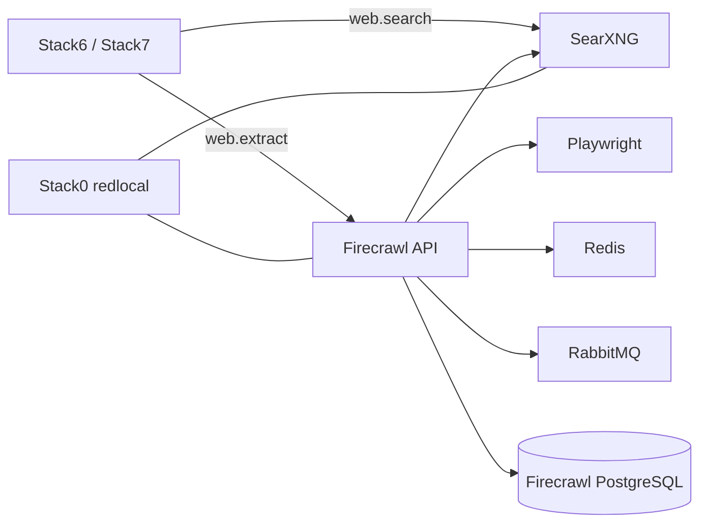

<!--
This Source Code Form is subject to the terms of the Mozilla Public
License, v. 2.0. If a copy of the MPL was not distributed with this
file, You can obtain one at https://mozilla.org/MPL/2.0/.
-->

# Stack 20 — SearXNG + Firecrawl

[Stack operations](../docs/operations.md) · [All stacks](../README.md#stacks-and-dependencies)

Stack2 provides local web search and page extraction. It is optional for AI consumers: Stack6 and Stack7 can operate without it, but web capabilities remain disabled rather than silently falling back to an external service.

## Contract

- **Requires:** Stack0.
- **Provides:** `web.search` and `web.extract`.
- **Optional consumers:** Stack6 and Stack7.
- **DR:** reconstructable; caches, queue state and Firecrawl database state are not recovery artifacts.
- **Network:** application services remain internal to `redlocal` unless explicitly exposed through Stack1.

`.lock` means **PREPARED only**. Deployment and readiness are separate lifecycle states. The wrappers do not wait for provider endpoints or reconcile optional consumers automatically.

## Unattended preparation wrapper

Run `./local-ai stack-20 install` from the repository root (as root for
initial preparation). After checking Stack 00's lock, the wrapper creates
only Stack 20's persistent directories using the scoped platform bootstrap,
then invokes the stack's `01-prepare.py` package module with closed stdin,
forwards its output, and requires a regular `.lock`
after success. If the lock already exists, it does nothing and explains the
risk of manually removing it before reconfiguration.

The `install` verb prints `./local-ai stack-20 start` but never runs it.
`wait-ready.py` is a separate check for after the containers are started; it
is not part of unattended preparation.

`./local-ai stack-20 start` runs `docker compose up -d` after checking `.lock`; `./local-ai stack-20 stop` runs `docker compose down` without `--volumes`. Stop removes this stack's containers, not its persistent bind-mounted data or Stack0's external network. Start does not run `wait-ready.py` or reconcile optional consumers; run those phases separately before claiming `web.search` or `web.extract` is READY.

Run both lifecycle verbs as root; `stop` remains available if `.lock` is missing.

`./local-ai stack-20 status` reports the state and health of all eight services. SearXNG checks `/healthz`; the Node-based MCP, Firecrawl API and Playwright healthchecks establish only local TCP reachability, not a successful search, scrape or MCP request. `status --deep` additionally runs an authenticated, read-only `SELECT 1` inside `firecrawl-postgres` using its application role. It does not wait or alter the database.

## PostgreSQL identity model

Stack2 uses one PostgreSQL cluster and keeps the database name `postgres` because the pinned NuQ image configures `pg_cron` against it. Security separation is therefore performed with roles rather than by moving Firecrawl to another database.

Two identities are intentionally distinct:

- `postgres` — administrative/bootstrap identity used for initialization, ownership, extensions and cron management. `FIRECRAWL_POSTGRES_ADMIN_PASSWORD` lives in the protected root `.env` and is passed into PostgreSQL by Compose; no password file is mounted.
- `firecrawl` — least-privilege application login used by Firecrawl during normal operation. Its credential is installation-owned configuration.

The bootstrap grants only the schema/table/sequence access needed by the application and establishes default privileges for future NuQ objects created by the administrative role.

## Persistent runtime invariants

Persistent directories include SearXNG state and the Firecrawl Redis, RabbitMQ and PostgreSQL runtime areas. PREPARE must preserve existing persistent state. In particular, an initialized PostgreSQL data directory is runtime-owned and must not be recursively `chown`ed, permission-normalized or recreated as a routine repair action.

Run `sudo ./local-ai env bootstrap` from the repository root before preparation. It generates a password for a new runtime or adopts the existing runtime password into `.env`. Preparation checks that the two copies match and never rotates either one. Rotating only one side of a persistent database credential contract is not a supported configuration change.

## Capability behaviour

Stack 20 is a provider, not a hard dependency of Stacks 60 or 70. If it is absent or not READY, consumers must keep web tools explicitly disabled. Once it becomes READY, consumer capability configuration can be reconciled separately.

`start` and `status` do not change consumer configuration; inspect each consumer's README for its separate reconciliation phase.

## Security invariants

- PostgreSQL is reachable through Docker networking, not by an unnecessary host `5432` publication.
- Administrative and application database identities remain separate.
- The administrative database secret stays outside Git; `.env` and its private backup contain the canonical value.
- Existing PGDATA metadata is preserved during PREPARE.
- Missing Stack2 capability never enables an undeclared external web fallback.
- The operator entry point is `./local-ai stack-20`; it does not automate capability reconciliation.

Key implementation files: `docker-compose.yml`, `config/searxng/`, `config/postgres/020-firecrawl-app-role.sh`, `01-prepare.py`, and `wait-ready.py`.
