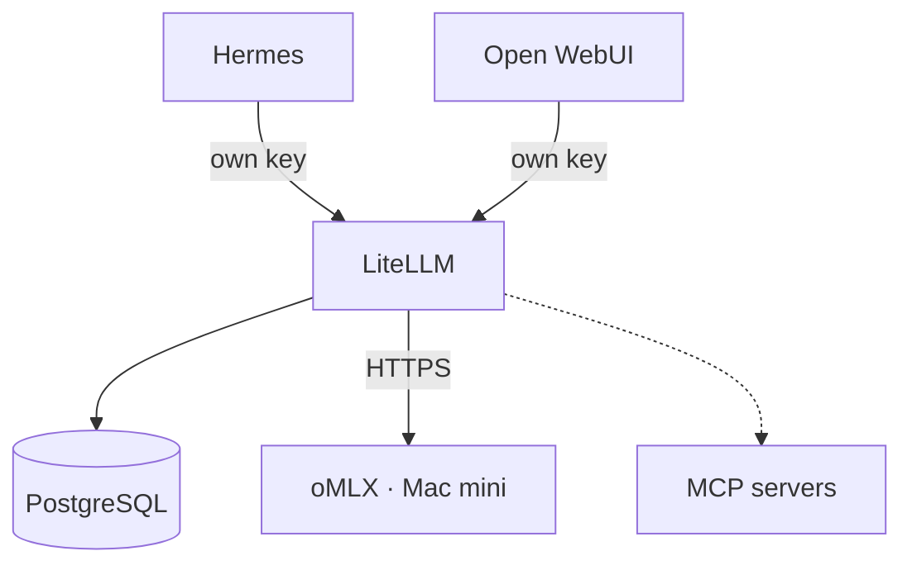
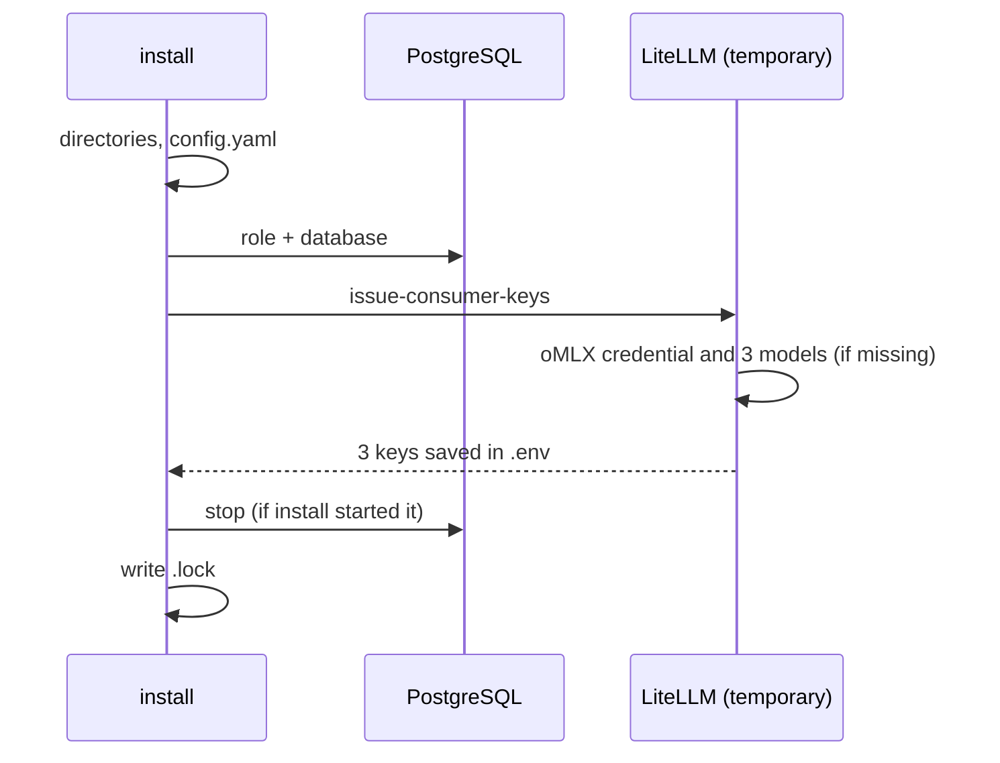

<!--
This Source Code Form is subject to the terms of the Mozilla Public
License, v. 2.0. If a copy of the MPL was not distributed with this
file, You can obtain one at https://mozilla.org/MPL/2.0/.
-->

# Stack 30 — LiteLLM

[Reading guide](../README.md#reading-guide) · [Operations](../docs/operations.md) · Next: [Stack 70 · Open WebUI](../stack-70_-_open-webui/README.md)

The AI gateway. Every consumer reaches models (and MCP servers) through LiteLLM with its own scoped key. Models are served by oMLX on the Mac mini.

| | |
| --- | --- |
| Install requires | Stack 00; in `.env`: `OMLX_API_KEY` (copied from the Mac mini) and the generated LiteLLM secrets |
| Containers | `litellm-postgres`, `litellm` (Compose project `Stack3 - LiteLLM`) |
| Published at | `gwia.casa.lan` through Stack 10 |
| Runtime data | `${BASE_PATH}/service_-_litellm/config`, `service_-_litellm-postgres/data` (**back up**: models, credentials, keys) |
| `status --deep` | Authenticated `SELECT 1` on PostgreSQL |

## What `install` sets up

- **Models are database-managed.** The three public aliases map to `OMLX_MODEL_GENERAL`, `OMLX_MODEL_AGENT`, and `OMLX_MODEL_CODING` (default `qwen36:*`). They are not in `config.yaml`, so you can edit them in the Admin UI. `install` never overwrites an existing credential or model.
- **Keys.** Hermes gets an inference key (`LITELLM_API_KEY`) and an MCP key with no MCP grants yet (`LITELLM_MCP_API_KEY`). Open WebUI gets an inference key (`OPENWEBUI_LITELLM_API_KEY`). Inference keys start with the three oMLX models and only `llm_api_routes`, so their model selection remains editable in LiteLLM. On a retry, an active editable key in `.env` retains the operator's model selection; a missing or legacy key with `info_routes` is replaced. Keys are never printed.
- **No inference test.** `install` does not call oMLX; check a real completion after `start`.

## Notes

- **Rotating the oMLX key.** Changing `OMLX_API_KEY` later does not update LiteLLM's stored credential. Edit the `oMLX` credential in the Admin UI.
- **MCP.** Registering MCP servers (for example Stack 20's `searxng-mcp` and `firecrawl-mcp`) and granting them to the Hermes MCP key is a manual step in the Admin UI.
- **Installation identity.** `LITELLM_SALT_KEY` encrypts stored credentials. Losing or changing it makes them unreadable, so keep it with your backups.
- **PostgreSQL 18 layout.** The host directory is mounted at `/var/lib/postgresql`; PGDATA is `/var/lib/postgresql/18/docker`. A major-version upgrade needs a dump and restore, not an image change.
- **Two database identities.** `postgres` is used only for provisioning (`LITELLM_POSTGRES_ADMIN_PASSWORD`); LiteLLM uses `LITELLM_DB_USER`.

Files: `docker-compose.yml`, `config/litellm/config.yaml`, `01-prepare.py`, `provision-postgres.py`, `issue-consumer-keys.py`.
