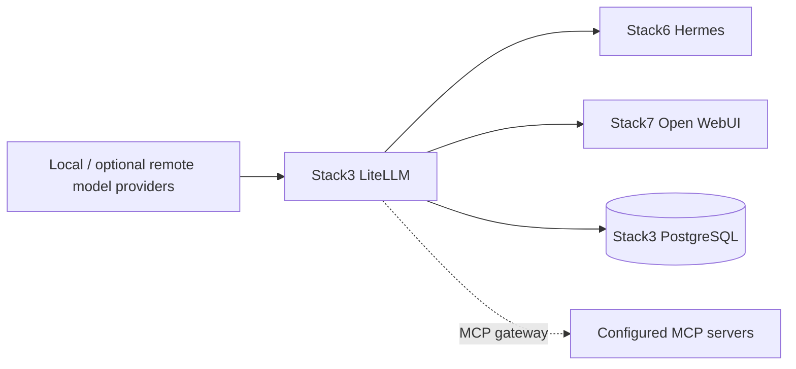
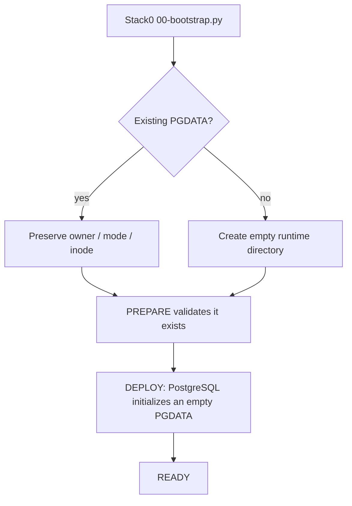

<!--
This Source Code Form is subject to the terms of the Mozilla Public
License, v. 2.0. If a copy of the MPL was not distributed with this
file, You can obtain one at https://mozilla.org/MPL/2.0/.
-->

# Stack 30 — LiteLLM + PostgreSQL

[Stack operations](../docs/operations.md) · [All stacks](../README.md#stacks-and-dependencies)

Stack3 is the central OpenAI-compatible AI gateway. It is the policy and credential boundary between local/remote model providers and application consumers such as Stack6 Hermes and Stack7 Open WebUI.

## Contract

- **Requires:** Stack0.
- **Provides:** `ai.gateway` and MCP/model gateway capabilities.
- **Required by:** Stack6 and Stack7.
- **DR:** logical PostgreSQL backup plus protected identity/configuration material; raw PGDATA is not the recovery artifact.

Stack3 does not depend on Stack2. Web search/extraction is a separate optional capability supplied by Stack2 and consumed by higher-level applications.

## PostgreSQL identity model

Stack3 owns a dedicated PostgreSQL cluster. Administrative bootstrap identity and LiteLLM application identity are deliberately separate:

- `postgres` is reserved for cluster bootstrap and administration. `LITELLM_POSTGRES_ADMIN_PASSWORD` lives in the protected root `.env` and is passed into PostgreSQL by Compose; no password file is mounted.
- the configured LiteLLM database user is the application identity used during normal operation; its database name and credential are installation-owned persistent configuration.

`LITELLM_SALT_KEY`, database identity and persistent credentials are part of the installation identity. PREPARE and routine upgrades must preserve them rather than regenerate them.
Run `sudo ./local-ai env bootstrap` from the repository root before preparation. It generates the administrative password in the protected `.env`. Neither preparation nor provisioning creates a password file.

## PGDATA contract

The Stack3 PostgreSQL data directory is runtime-owned state. Stack0 `00-bootstrap.py` creates it only when absent; PREPARE validates and preserves an existing PGDATA directory; it must not recursively change owner/mode, replace its inode, reset the database or recreate the cluster as a routine configuration repair. PostgreSQL 18 uses `/var/lib/postgresql/18/docker` as PGDATA, so Compose mounts the host's `service_-_litellm-postgres/data` at `/var/lib/postgresql`. The outer mount directory is created as `0755` so PostgreSQL can traverse it after dropping root privileges; the inner PGDATA remains private at `0700`. PostgreSQL 17 and older images are not compatible with this mount contract. A major-version change requires a deliberate database migration, not an image-only edit.

`.lock` means **PREPARED only**. It is not proof that PostgreSQL or LiteLLM is running or healthy.

## Unattended preparation wrapper

Before `install`, copy the Mac mini's oMLX API key into `OMLX_API_KEY` in the protected root `.env`; the installer rejects a missing or placeholder value and reports this prerequisite. `OMLX_BASE_URL` defaults to `https://mlx.casa.lan/v1`. Set `OMLX_MODEL_GENERAL`, `OMLX_MODEL_AGENT`, and `OMLX_MODEL_CODING` to the oMLX model IDs or profiles (the template uses `qwen36:general`, `qwen36:agent`, and `qwen36:coding`). The three public aliases are fixed: `mlx/local-general`, `mlx/local-agent`, and `mlx/local-coding`.

Run `sudo ./local-ai stack-30 install` from the repository root. After checking Stack 00's lock, the wrapper creates only Stack 30's service directories using the scoped platform bootstrap, prepares configuration, provisions the PostgreSQL application role/database, then briefly runs LiteLLM in a disposable container. Through its management API it creates the `oMLX` credential and any missing database-managed model aliases before issuing distinct Hermes inference, Hermes MCP, and Open WebUI keys. Existing credential/model names are left untouched so GUI edits survive a retry. Before reusing a consumer key from `.env`, install checks that it is active and has its required model or MCP route in the current database; it replaces stale keys left by a database reset, with a private `.env` backup. The installer removes the temporary container and stops PostgreSQL if it was started by install. Issued keys are written only to the protected `.env`, never printed. The MCP key has no initial server grants; register MCPs and grant access yourself in LiteLLM. `.lock` is written only when all install phases complete. Installation does not perform inference or prove oMLX reachability.

Model and provider-credential definitions are deliberately absent from `config.yaml` so they remain editable in LiteLLM's Admin UI. Existing running services and database-managed models are not changed by editing the repository YAML alone; deploying its updated copy requires a deliberate configuration update and restart.

The installer copies the oMLX API key from `.env` into LiteLLM's encrypted database credential at creation time. Changing `OMLX_API_KEY` later does not update that existing credential; rotate it in the LiteLLM Admin UI before restarting consumers. The installer never overwrites an existing credential or model alias.
It registers the credential as **Openai Like** and the three models as **OpenAI-Compatible** endpoints: each upstream model identifier is the bare oMLX profile (for example, `qwen36:agent`), without an `openai/` prefix. The public `mlx/local-*` aliases remain independent of those upstream identifiers.

`sudo ./local-ai stack-30 start` runs `docker compose up -d` after checking `.lock`. `stop` runs `docker compose down` without `--volumes`, retaining PostgreSQL data and `.lock`. Neither verb proves model inference succeeds; that belongs to a later verify procedure.

Run both lifecycle verbs as root; `stop` remains available if `.lock` is missing.

`./local-ai stack-30 status` reports PostgreSQL and LiteLLM health. The existing PostgreSQL `pg_isready` healthcheck only tests server readiness; `status --deep` adds an authenticated, read-only `SELECT 1` inside the PostgreSQL container. This still does not prove that a model inference request succeeds.

## Credential and policy boundary

Application consumers use dedicated least-privilege virtual credentials rather than `LITELLM_MASTER_KEY`. Provider policy also stays behind LiteLLM: consumers should not bypass the gateway to reach model providers directly.

MCP traffic follows the same boundary when routed through LiteLLM. Review `config/litellm/config.yaml` and the protected environment when changing gateway routes.

## Security invariants

- Administrative PostgreSQL credentials remain outside Git in the protected root `.env`.
- LiteLLM consumers receive scoped credentials instead of the master key.
- Persistent identity material is preserved across PREPARE and guarded upgrades.
- Applications consume the gateway rather than embedding provider credentials or provider-selection policy.
- The operator entry point is `./local-ai stack-30`; PostgreSQL provisioning is part of `install`.

Key implementation files: `docker-compose.yml`, `config/litellm/config.yaml`, `01-prepare.py`, `provision-postgres.py`, and `issue-consumer-keys.py`.
