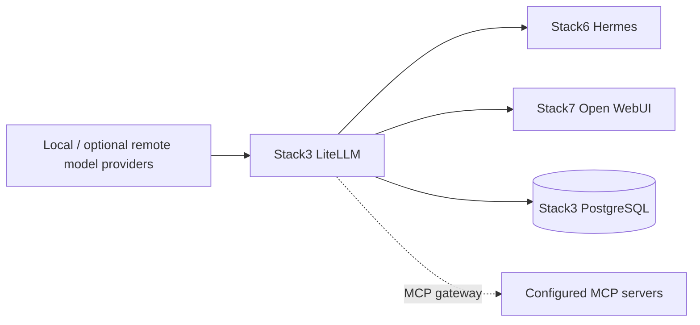
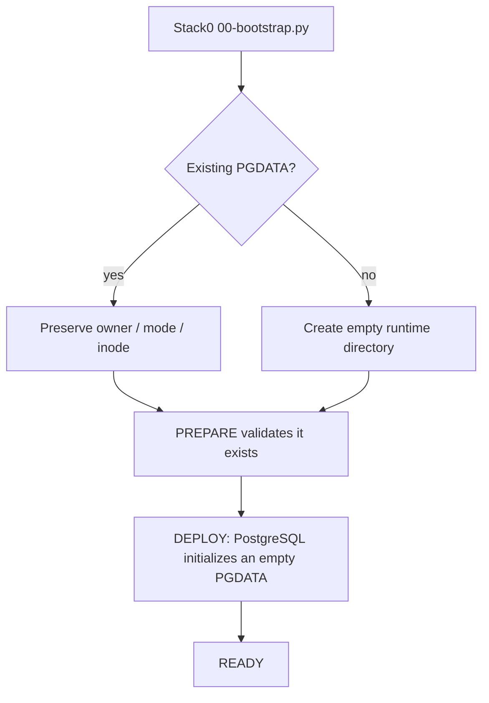

<!--
This Source Code Form is subject to the terms of the Mozilla Public
License, v. 2.0. If a copy of the MPL was not distributed with this
file, You can obtain one at https://mozilla.org/MPL/2.0/.
-->

# Stack 30 — LiteLLM + PostgreSQL

[Stack operations](../docs/operations.md) · [All stacks](../README.md#stacks-and-dependencies)

Stack3 is the central OpenAI-compatible AI gateway. It is the policy and credential boundary between local/remote model providers and application consumers such as Stack6 Hermes and Stack7 Open WebUI.

## Contract

- **Requires:** Stack0.
- **Provides:** `ai.gateway` and MCP/model gateway capabilities.
- **Required by:** Stack6 and Stack7.
- **DR:** logical PostgreSQL backup plus protected identity/configuration material; raw PGDATA is not the recovery artifact.

Stack3 does not depend on Stack2. Web search/extraction is a separate optional capability supplied by Stack2 and consumed by higher-level applications.

## PostgreSQL identity model

Stack3 owns a dedicated PostgreSQL cluster. Administrative bootstrap identity and LiteLLM application identity are deliberately separate:

- `postgres` is reserved for cluster bootstrap and administration. Its administrative password is stored in runtime secret storage outside the protected root `.env`.
- the configured LiteLLM database user is the application identity used during normal operation; its database name and credential are installation-owned persistent configuration.

`LITELLM_SALT_KEY`, database identity and persistent credentials are part of the installation identity. PREPARE and routine upgrades must preserve them rather than regenerate them.

## PGDATA contract

The Stack3 PostgreSQL data directory is runtime-owned state. Stack0 `00-bootstrap.py` creates it only when absent; PREPARE validates and preserves an existing PGDATA directory; it must not recursively change owner/mode, replace its inode, reset the database or recreate the cluster as a routine configuration repair.

`.lock` means **PREPARED only**. It is not proof that PostgreSQL or LiteLLM is running or healthy.

## Unattended preparation wrapper

Run `python3 -B wrapper/bin/stack-30.py install` from the repository root (as root for
initial preparation). The wrapper calls only the stack's `01-prepare.py`
package module, with closed stdin. It reports an existing `.lock` without
changing anything and requires a regular lock after successful preparation.

`install` **does not** execute `provision-postgres.py` or start containers. It prints
the manual PostgreSQL provisioning and Compose startup commands as separate
next steps; a preparation lock alone does not prove the database is ready.

`python3 -B wrapper/bin/stack-30.py start` runs `docker compose up -d` after checking `.lock`; it does **not** provision PostgreSQL first. On a new installation, run `provision-postgres.py` as instructed above before starting LiteLLM. `python3 -B wrapper/bin/stack-30.py stop` runs `docker compose down` without `--volumes`, removing containers but retaining the PostgreSQL bind-mounted data and `.lock`. Neither verb proves LiteLLM is healthy.

Run both lifecycle verbs as root; `stop` remains available if `.lock` is missing.

`python3 -B wrapper/bin/stack-30.py status` reports PostgreSQL and LiteLLM health. The existing PostgreSQL `pg_isready` healthcheck only tests server readiness; `status --deep` adds an authenticated, read-only `SELECT 1` inside the PostgreSQL container. This still does not prove that a model inference request succeeds.

## Credential and policy boundary

Application consumers use dedicated least-privilege virtual credentials rather than `LITELLM_MASTER_KEY`. Provider policy also stays behind LiteLLM: consumers should not bypass the gateway to reach model providers directly.

MCP traffic follows the same boundary when routed through LiteLLM. Review `config/litellm/config.yaml` and the protected environment when changing gateway routes.

## Security invariants

- Administrative PostgreSQL credentials remain outside Git and outside the root `.env`.
- LiteLLM consumers receive scoped credentials instead of the master key.
- Persistent identity material is preserved across PREPARE and guarded upgrades.
- Applications consume the gateway rather than embedding provider credentials or provider-selection policy.
- The operator entry point is `wrapper/bin/stack-30.py`; PostgreSQL provisioning remains a separate step.

Key implementation files: `docker-compose.yml`, `config/litellm/config.yaml`, `01-prepare.py`, and `provision-postgres.py`.
