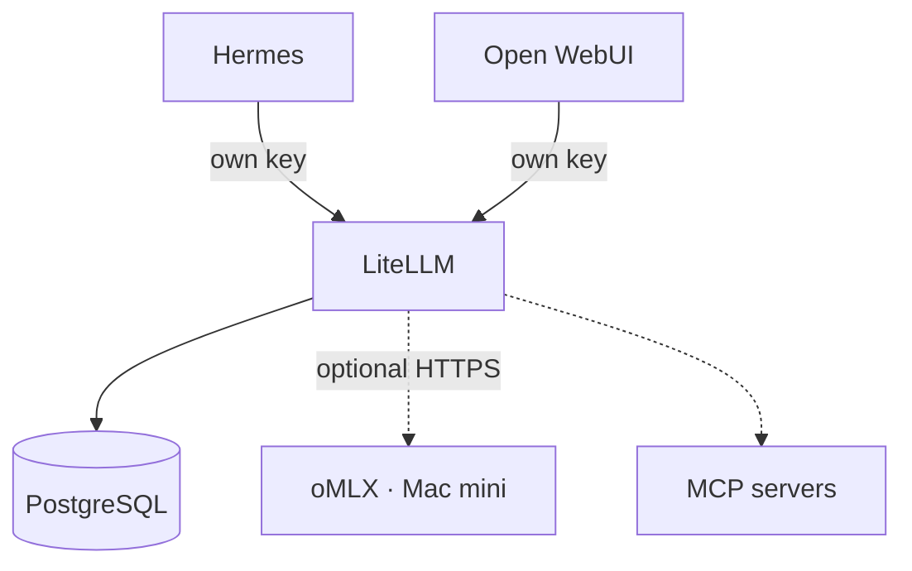
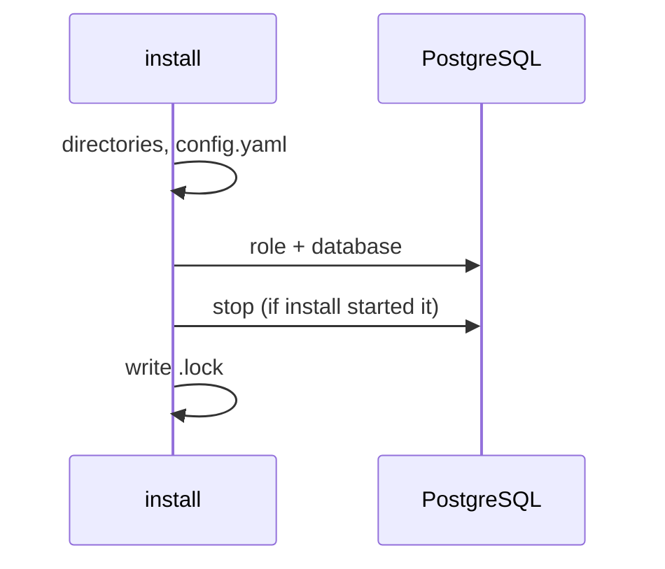

<!--
This Source Code Form is subject to the terms of the Mozilla Public
License, v. 2.0. If a copy of the MPL was not distributed with this
file, You can obtain one at https://mozilla.org/MPL/2.0/.
-->

# Stack 30 — LiteLLM

[Reading guide](../README.md#reading-guide) · [Operations](../docs/operations.md) · Next: [Stack 70 · Open WebUI](../stack-70_-_open-webui/README.md)

The AI gateway. A fresh install starts with an empty model catalog and administrative access. Consumers need their own scoped keys before they can use models or MCP servers. An operator may configure LiteLLM from scratch or restore a compatible database snapshot; an oMLX connection is optional, not installed by this stack.

| | |
| --- | --- |
| Install requires | Stack 00 and generated LiteLLM/PostgreSQL secrets in `.env`; no provider credentials or consumer keys |
| Containers | `litellm-postgres`, `litellm` (Compose project `Stack3 - LiteLLM`) |
| Published at | `gwia.casa.lan` through Stack 10 |
| Runtime data | `${BASE_PATH}/service_-_litellm/config`, `service_-_litellm-postgres/data` (**back up**: models, credentials, keys) |
| `status --deep` | Authenticated `SELECT 1` on PostgreSQL |

## What `install` sets up

- **Administrative access.** After `./local-ai stack-30 start`, use the LiteLLM Admin UI with `UI_USERNAME` and `UI_PASSWORD` from the protected `.env`. The master key is also in `.env`. Keep both private. `status` verifies containers and PostgreSQL, not a UI login.
- **Empty by default.** `install` creates no models, provider credentials, virtual keys, MCP registrations, or access grants. `config.yaml` has no `model_list`; the database is the source of truth. Existing database state is preserved, not reset by `install`.
- **Next step.** Configure providers, models, and scoped consumer keys in the LiteLLM Admin UI. Put the resulting Hermes/Open WebUI keys in `.env` before installing those stacks. A reusable database snapshot and safe restore procedure are planned but not yet provided. A database dump alone does not supply the original encryption salt or plaintext virtual keys; preserve and reconcile the corresponding secrets separately.

## Notes

- **Provider credentials.** Store any oMLX credential in LiteLLM's database through the Admin UI or a future restore process, not in Stack 30 Compose variables.
- **MCP.** Registering MCP servers (for example Stack 20's `searxng-mcp` and `firecrawl-mcp`) and granting them to the Hermes MCP key is a manual step in the Admin UI.
- **Installation identity.** `LITELLM_SALT_KEY` encrypts stored credentials. Losing or changing it makes them unreadable, so keep it with your backups.
- **PostgreSQL 18 layout.** The host directory is mounted at `/var/lib/postgresql`; PGDATA is `/var/lib/postgresql/18/docker`. A major-version upgrade needs a dump and restore, not an image change.
- **Two database identities.** `postgres` is used only for provisioning (`LITELLM_POSTGRES_ADMIN_PASSWORD`); LiteLLM uses `LITELLM_DB_USER`.

Files: `docker-compose.yml`, `config/litellm/config.yaml`, `01-prepare.py`, `provision-postgres.py`.
