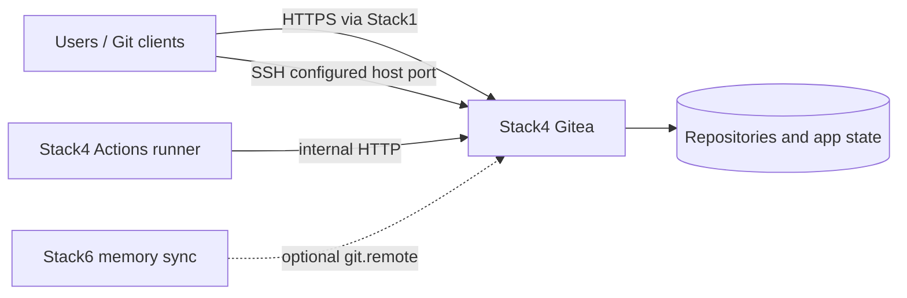

<!--
This Source Code Form is subject to the terms of the Mozilla Public
License, v. 2.0. If a copy of the MPL was not distributed with this
file, You can obtain one at https://mozilla.org/MPL/2.0/.
-->

# Stack 40 — Gitea + Runner

[Stack operations](../docs/operations.md) · [All stacks](../README.md#stacks-and-dependencies)

Stack4 provides the local Git service and an Actions runner. Gitea serves HTTP on `redlocal`; Stack1 is responsible for optional HTTPS publication. Gitea SSH may be published directly on the configured host port.

## Contract

- **Requires:** Stack0.
- **Optional relationship:** Stack1 may publish the HTTP service.
- **Provides:** `git.remote` and `git.runner`.
- **Owns:** Gitea and runner containers plus their runtime areas.
- **Recovery:** Gitea application/repository state must be backed up separately. Runner registration/runtime can be reconstructed; the wrappers do not perform backup or restore.

Stack4's managed configuration files are source artifacts. PREPARE renders installation-specific values from protected operational configuration rather than embedding a second full configuration template inside shell code.

## Runtime ownership

Gitea and its runner have separate runtime areas. Existing runner registration identity may be preserved during ordinary local convergence, but it is operational runtime rather than durable DR authority: the manifest recovery contract backs up Gitea state only and reconstructs the runner when necessary.

Historical TLS-specific runner artifacts are not part of the current architecture. The runner reaches Gitea over internal HTTP on `redlocal`; external TLS termination belongs to Stack 10.

`.lock` means **PREPARED only**. It does not prove migrations have run, the configured administrator exists, the runner is registered or either service is healthy.

## Unattended preparation wrapper

Run `python3 -B wrapper/bin/stack-40.py install` from the repository root (as root for
initial preparation). It invokes only the stack's `01-prepare.py` package
module, forwards its output, and requires a regular `.lock` after success.
An existing lock is explained without changing configuration or removing it.

`install` **does not** run `deploy-gitea.py`. It prints that command as a
manual next step for migrations, administrator setup, runner registration,
and startup. PREPARED does not mean Gitea is running.

`python3 -B wrapper/bin/stack-40.py start` runs `docker compose up -d` after checking `.lock`; it does **not** perform Gitea migrations, create the administrator or register the runner. On first deployment, run `deploy-gitea.py` separately. `python3 -B wrapper/bin/stack-40.py stop` runs `docker compose down` without `--volumes`; it removes containers, not Gitea's bind-mounted state or `.lock`. Start is not a health check.

Run both lifecycle verbs as root; `stop` remains available if `.lock` is missing.

`python3 -B wrapper/bin/stack-40.py status` reports Gitea HTTP health and runner container health. The runner healthcheck requires its persistent registration marker; it cannot prove that the runner accepts or completes jobs. `status --deep` currently has no additional probe.

## Lifecycle

Use `wrapper/bin/stack-40.py` for preparation, start, stop, and status. `deploy-gitea.py` is still a separate first-deployment phase; no wrapper performs upgrades or recovery. Re-preparation may converge managed configuration while preserving application runtime, but should only follow a reviewed removal of `.lock`.

## Security and recovery invariants

- Gitea application secrets and administrative credentials remain outside Git.
- Internal runner-to-Gitea traffic stays on `redlocal`; external TLS belongs to Stack1.
- Persistent Gitea identity/state is preserved across PREPARE and guarded operations.
- A reliable Gitea backup requires a separately reviewed procedure rather than copying an arbitrary live filesystem tree.
- Runner state must not be mistaken for a backup resource merely because Stack 40 owns its runtime directory.

Key implementation files: `docker-compose.yml`, `config/gitea/app.ini`, `config/gitea-runner/config.yaml`, `01-prepare.py`, and `deploy-gitea.py`.
