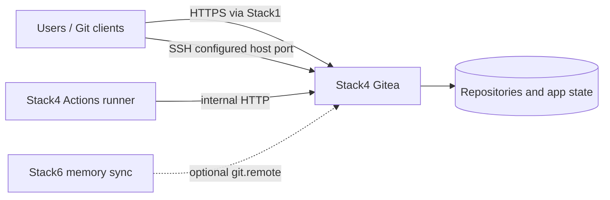

<!--
This Source Code Form is subject to the terms of the Mozilla Public
License, v. 2.0. If a copy of the MPL was not distributed with this
file, You can obtain one at https://mozilla.org/MPL/2.0/.
-->

# Stack4 — Gitea + Runner

[Documentation TOC](../docs/TOC.md) · [Stack map](../docs/stacks/README.md) · [OpenSpec contract](../docs/devel-docs/openspec/stacks/stack4.feature)

Stack4 provides the local Git service and an Actions runner. Gitea serves HTTP on `redlocal`; Stack1 is responsible for optional HTTPS publication. Gitea SSH may be published directly on the configured host port.

## Contract

- **Requires:** Stack0.
- **Optional relationship:** Stack1 may publish the HTTP service.
- **Provides:** `git.remote` and `git.runner`.
- **Owns:** Gitea and runner containers plus their runtime areas.
- **Component management:** Gitea is a versioned component but currently inventory-only for normal upgrades because a migration policy is required; the runner is explicitly classified `local`, with external availability/normal upgrade discovery disabled.
- **DR:** Gitea application/repository state is a managed `gitea-native-dump` recovery resource. Runner registration/runtime is reconstructable and is not a managed DR artifact.

Stack4's managed configuration files are source artifacts. PREPARE renders installation-specific values from protected operational configuration rather than embedding a second full configuration template inside shell code.

## Runtime ownership

Gitea and its runner have separate runtime areas. Existing runner registration identity may be preserved during ordinary local convergence, but it is operational runtime rather than durable DR authority: the manifest recovery contract backs up Gitea state only and reconstructs the runner when necessary.

Historical TLS-specific runner artifacts are not part of the current architecture. The runner reaches Gitea over internal HTTP on `redlocal`; external TLS termination belongs to Stack1.

`.lock` means **PREPARED only**. It does not prove migrations have run, the configured administrator exists, the runner is registered or either service is healthy.

## Unattended preparation wrapper

Run `python3 -B wrapper/bin/stack-40.py install` from the repository root (as root for
initial preparation). It invokes only the stack's `01-prepare.py` package
module, forwards its output, and requires a regular `.lock` after success.
An existing lock is explained without changing configuration or removing it.

The wrapper **does not** run `deploy-gitea.py`. It prints that command as a
manual next step for migrations, administrator setup, runner registration,
and startup. PREPARED does not mean Gitea is running.

## Lifecycle

The supported lifecycle is orchestrated through `./local-ai`. Stack-owned prepare/run scripts are implementation phases, not operator APIs. Re-preparation may converge managed configuration while preserving appropriate application runtime; it is not a substitute for normal start/stop or upgrade operations.

## Security and recovery invariants

- Gitea application secrets and administrative credentials remain outside Git.
- Internal runner-to-Gitea traffic stays on `redlocal`; external TLS belongs to Stack1.
- Persistent Gitea identity/state is preserved across PREPARE and guarded operations.
- Backup/restore follows the manifest-declared Gitea-native recovery contract rather than copying an arbitrary live filesystem tree.
- Runner state must not be mistaken for a managed backup resource merely because Stack4 owns its runtime directory.
- `./local-ai` remains the supported management boundary.

## Related decisions

- [SDR-0004 — internal-only service networking](../docs/devel-docs/sdr/0004-internal-only-service-networking.md)
- [Gitea disaster recovery](../docs/dr/gitea.md)
- [Configuration and secrets](../docs/configuration/env-secrets.md)
- [Manifest component inventory](../docs/devel-docs/adr/0007-manifest-component-inventory.md)

Key implementation files: `docker-compose.yml`, `config/gitea/app.ini`, `config/gitea-runner/config.yaml`, `manifest.json`, and stack lifecycle scripts.
