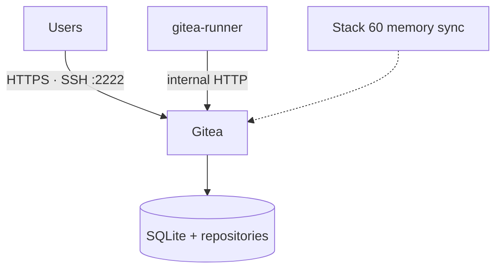

<!--
This Source Code Form is subject to the terms of the Mozilla Public
License, v. 2.0. If a copy of the MPL was not distributed with this
file, You can obtain one at https://mozilla.org/MPL/2.0/.
-->

# Stack 40 — Gitea + Runner

[Reading guide](../README.md#reading-guide) · [Operations](../docs/operations.md) · Next: [Stack 50 · Dockhand](../stack-50_-_dockhand/README.md)

Local Git server with a Gitea Actions runner. Optionally, it also hosts Hermes' memory repository.

| | |
| --- | --- |
| Install requires | Stack 00; `GITEA_ADMIN_*` and the Gitea secrets in `.env` |
| Containers | `gitea` (rootless), `gitea-runner` (Compose project `Stack4 - Gitea`) |
| Published at | `git.casa.lan` through Stack 10; SSH directly on `GITEA_SSH_BIND:GITEA_SSH_PORT` |
| Runtime data | `${BASE_PATH}/service_-_gitea/{config,data}` (**back up**), `service_-_gitea-runner/{data,secret}` (reconstructable) |
| `status` | Gitea `/api/healthz`; runner has a registration file (not proof that it runs jobs) |

## What `install` sets up

1. Renders `app.ini` and the runner `config.yaml` from `config/` and `.env`. It keeps an existing runner registration token in `service_-_gitea-runner/secret/`.
2. `deploy-gitea.py`: in disposable containers, runs `gitea migrate` on the empty SQLite database, then creates the administrator if missing.
3. Writes `.lock`. Gitea and the runner start only with `start`.

This initializes a **fresh** installation. Importing or upgrading an older Gitea is a manual procedure.

## Notes

- **Backups.** Back up `service_-_gitea` with Gitea stopped, or use `gitea dump`. The runner can be re-registered, so it needs no backup.
- **Internal traffic stays internal.** The runner talks to Gitea over plain HTTP on `redlocal`; TLS ends at HAProxy.

Files: `docker-compose.yml`, `config/gitea/app.ini`, `config/gitea-runner/config.yaml`, `01-prepare.py`, `deploy-gitea.py`.
