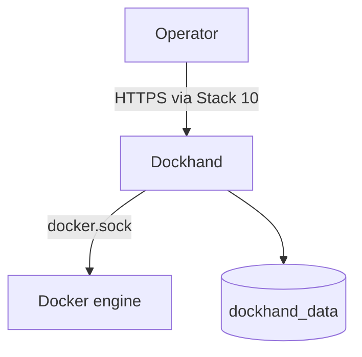

<!--
This Source Code Form is subject to the terms of the Mozilla Public
License, v. 2.0. If a copy of the MPL was not distributed with this
file, You can obtain one at https://mozilla.org/MPL/2.0/.
-->

# Stack 50 — Dockhand

[Operations](../docs/operations.md) · [All stacks](../README.md#stacks)

Optional web UI for managing Docker. No other stack depends on it.

| | |
| --- | --- |
| Install requires | Only the `redlocal` network and the `.env` link (normally created by Stack 00); no `.lock` from Stack 00 |
| Containers | `dockhand` (Compose project `Stack5 - Dockhand`) |
| Published at | `homelab.casa.lan` through Stack 10 |
| Runtime data | External Docker volume `dockhand_data` (no `BASE_PATH` directory) |
| `status` | Local HTTP check on port 3000 |

## Notes

- **Root-equivalent access.** Dockhand mounts the Docker socket, so anyone logged into it controls the host. Protect its login, and do not publish it beyond your LAN.
- **`stop` keeps the container.** Unlike the other stacks, `stop` runs `docker compose stop`, so the next `start` reuses the same container. `status` then shows it as stopped, not absent.
- **The volume is preserved.** `install` creates `dockhand_data` only if it is missing; it never rewrites an existing one.

Files: `docker-compose.yml`, `01-prepare.py`.
