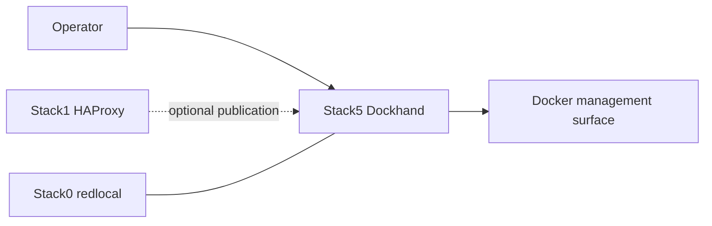

<!--
This Source Code Form is subject to the terms of the Mozilla Public
License, v. 2.0. If a copy of the MPL was not distributed with this
file, You can obtain one at https://mozilla.org/MPL/2.0/.
-->

# Stack 50 — Dockhand

[Stack operations](../docs/operations.md) · [All stacks](../README.md#stacks-and-dependencies)

Stack5 provides the Dockhand container-management UI. It is an operational convenience surface, not part of the AI request path and not a required dependency of other application stacks.

## Contract

- **Requires:** the configured shared Docker bridge network, root `.env`, and Docker Compose; it does not require Stack 00's `.lock` or host CA. Stack 00 normally creates the network and managed `.env` link.
- **Optional relation:** Stack1 may publish the UI.
- **Owns:** the `dockhand` container and external Docker volume `dockhand_data`.
- **DR:** reconstructable; Dockhand application state is not a recovery target.
- **Purpose:** operational convenience, not a prerequisite for the Python stack wrappers.

Dockhand persists through the external Docker volume `dockhand_data`; there is intentionally no Stack5 bind-mounted `service_-_dockhand` runtime directory. PREPARE creates the volume if absent and validates it, but does not migrate or rewrite existing contents.

`.lock` means **PREPARED only**. It does not mean the Dockhand container is running or healthy.

## Unattended preparation wrapper

Run `python3 -B wrapper/bin/stack-50.py install` from the repository root (as root for
initial preparation). The wrapper invokes only the stack's `01-prepare.py`
package module with closed stdin. Preparation may create the missing
`dockhand_data` volume, as authorized, but preserves an existing volume.

If `.lock` already exists, the wrapper changes nothing and explains the risk
of manually removing it. After successful preparation, `install` shows how to
run Docker Compose manually; `install` never starts Dockhand itself.

## Lifecycle behaviour

From the repository root, `python3 -B wrapper/bin/stack-50.py start` runs `docker compose up -d` after checking `.lock`. `python3 -B wrapper/bin/stack-50.py stop` deliberately runs **`docker compose stop`**, unlike the `down` used by Stacks 10–40 and 60–70. It stops Dockhand but preserves the existing container and the external `dockhand_data` volume; a later `start` can reuse the container without needlessly recreating this optional, reconstructable management UI. Dockhand is ephemeral in the recovery sense—it is not a platform dependency or DR target—but its Docker volume holds runtime application state and must not be treated as disposable merely because the container is. `down` would also leave this external volume intact by default; preserving the container, not rescuing the volume from `down`, is the reason for this exception.

Run both lifecycle verbs as root; `stop` remains available if `.lock` is missing.

`python3 -B wrapper/bin/stack-50.py status` reports Dockhand's container state and local HTTP health. After `stop`, the preserved container appears stopped rather than absent. HTTP health does not prove that Dockhand can manage Docker or that its external volume is backed up; `status --deep` currently has no additional probe.

The operator lifecycle is `wrapper/bin/stack-50.py start` / `stop`. Neither verb verifies Dockhand health or changes the preparation lock; use `status` separately. Dockhand must not become a hidden prerequisite for operating other stacks.

## Security invariants

- Stack5's Docker-management capability is intentionally separate from agent stacks; Hermes does not receive a Docker socket through Stack5.
- The external volume is runtime-owned and not rewritten during PREPARE.
- Dockhand does not define the platform management contract; each stack wrapper remains usable without it.

Key implementation files: `docker-compose.yml` and `01-prepare.py`.
