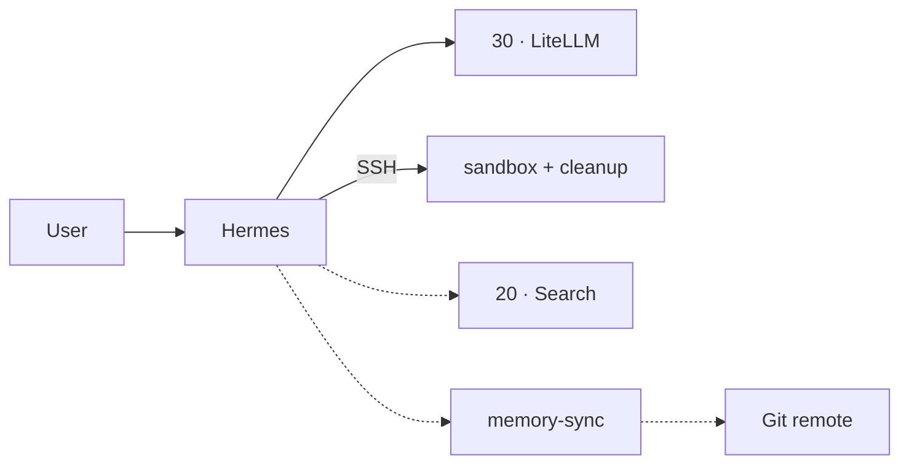

<!--
This Source Code Form is subject to the terms of the Mozilla Public
License, v. 2.0. If a copy of the MPL was not distributed with this
file, You can obtain one at https://mozilla.org/MPL/2.0/.
-->

# Stack 60 — Hermes

[Reading guide](../README.md#reading-guide) · [Operations](../docs/operations.md) · Next: [Stack 20 · SearXNG + Firecrawl](../stack-20_-_searxng_firecrawl/README.md)

The Hermes agent. It reaches models through LiteLLM, runs commands in an isolated SSH sandbox, and can optionally use web search and a Git-backed memory.

| | |
| --- | --- |
| Install requires | Stacks 00 and 30 (`LITELLM_API_KEY`, `LITELLM_MCP_API_KEY` in `.env`) |
| Containers | `hermes`, `hermes-sandbox`, `hermes-sandbox-cleanup`; optional `hermes-memory-sync` (Compose project `Stack6 - Hermes`) |
| Published at | `norai.casa.lan` → dashboard on port 9119, with basic auth (`HERMES_DASHBOARD_*`) |
| Runtime data | `${BASE_PATH}/${HERMES_SERVICE}`, `${HERMES_MEMORY_SERVICE}`, `${MEMORY_SYNC_SERVICE}`, `${SANDBOX_SERVICE}` |
| `status` | Hermes `/health`, sandbox `sshd`, cleanup state files; memory-sync (if active) has a Git checkout |

## Lifecycle specifics

- **Telegram.** Set `TELEGRAM_BOT_TOKEN` and a comma-separated `TELEGRAM_ALLOWED_USERS` list of numeric user IDs in the protected root `.env`, then run `./local-ai stack-60 start`. `start` rejects a token without an allowlist before changing the runtime. No interactive Hermes setup or inbound webhook is needed; verify with a message from an allowed user.
- **`reconfig`** previews managed `config.yaml` and runtime environment drift. `reconfig --apply` stages changes from `.env` (including `HERMES_MODEL`), preserves the current web-tool choice, and removes stale central overrides from runtime `data/.env`. It backs up changed files but never changes container state. Activate with `./local-ai stack-60 stop` and `./local-ai stack-60 start`. `start` retains its existing gateway-drift safety check.
- **`stop`** includes the `git-memory` profile, so the memory-sync container is removed as well. A plain `docker compose down` would leave it running.
- **Isolation.** Hermes has no Docker socket. Commands run in the sandbox, which is attached only to the private `hermes-exec` network.

## Optional features (manual scripts)

Run them from this directory as root, after `install`. None of them runs automatically.

- **Web tools:** start Stack 20, then run `reconcile-capabilities.py --restart`.
- **Git memory:** run in order `prepare-git-memory.py` (with Hermes stopped), then `prepare-maintenance-sidecars.py` (after placing the SSH key in `${MEMORY_SYNC_SERVICE}/ssh`), then `reconcile-capabilities.py --enable-git-memory --restart`.

| Script | Purpose |
| --- | --- |
| `reconcile-capabilities.py [--restart] [--enable-git-memory\|--disable-git-memory]` | Turn web tools on when `searxng` and `firecrawl-api` are reachable (off otherwise), and record the Git-memory choice |
| `prepare-git-memory.py` | Adopt the Git working tree (`GITMEM_REPOSITORY`, `GITMEM_BRANCH`) as memory without overwriting local changes |
| `prepare-maintenance-sidecars.py` | Check the memory-sync SSH material (`ssh_config`, `id_ed25519`, `known_hosts`) and its directories |
| `install-buzz.py` | Build and install the pinned Buzz CLI into Hermes' persistent data |
| `apply-terminal-timeout-workaround.py` | Patch a known Hermes terminal-timeout issue in the runtime code |
| `wait-ready.py` | Wait until the containers are ready after `start` |
| `cleanup.py [--reset-sandbox\|--reset-state\|--factory-reset] [--dry-run] [--yes]` | Clean up the runtime; the reset modes are destructive and ask for confirmation |

## Memory sync rules

The sidecar uses its own SSH identity, never force-pushes, stops when the branch has diverged, and commits only `MEMORY.md` and `USER.md`. That Git repository is the durable copy of the agent's memory; everything else in the sandbox can be rebuilt.

Files: `docker-compose.yml`, `config/` (Hermes config, sandbox, cleanup and memory-sync images, Buzz build), `01-prepare.py`, and the scripts above.
