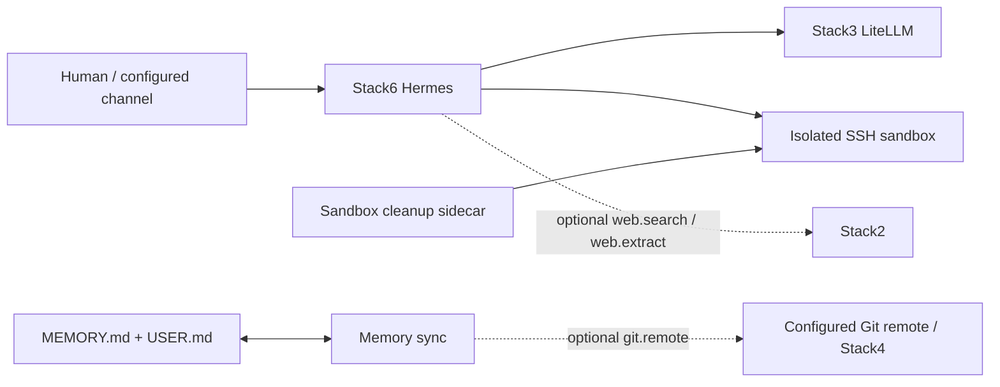
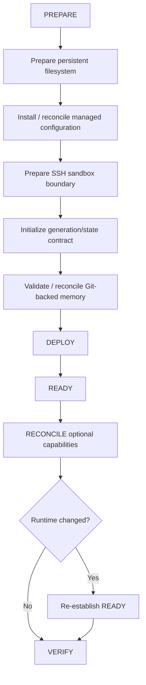

<!--
This Source Code Form is subject to the terms of the Mozilla Public
License, v. 2.0. If a copy of the MPL was not distributed with this
file, You can obtain one at https://mozilla.org/MPL/2.0/.
-->

# Stack 60 — Hermes

[Stack operations](../docs/operations.md) · [All stacks](../README.md#stacks-and-dependencies)

Stack6 is the agent runtime. It combines Hermes with isolated command execution, local-first AI access through Stack3, optional Stack2 web capabilities and portable Git-backed user memory.

## Contract

- **Requires:** Stack0 and Stack3.
- **Optional:** Stack2 `web.search` / `web.extract`; configured Git remote, commonly Stack4.
- **Owns:** Hermes runtime, sandbox execution surface and Stack6 maintenance sidecars.
- **DR:** runtime and sandbox are reconstructable. Durable user memory is the Git-backed `MEMORY.md` + `USER.md` contract and is verified as an external prerequisite rather than copied as arbitrary container state.

Stack 20 is deliberately optional. When its provider capabilities are absent or not READY, Hermes web tools must remain disabled. Capability reconciliation is a separate action after the provider is proven ready.

## Isolation boundary

Hermes does **not** receive the Docker socket. Arbitrary command execution crosses a dedicated SSH boundary into the sandbox rather than becoming platform-level Docker control. The sandbox is attached to its private execution network and is not promoted to the shared service network merely for convenience.

Maintenance sidecars operate on Stack6-owned state only. Sandbox cleanup and reset semantics remain deterministic and do not grant Hermes broader platform administration.

The model/provider boundary is also externalized: Hermes talks to Stack3 through dedicated least-privilege gateway credentials instead of carrying provider master credentials itself.

## Preparation and convergence

The complete Stack 60 deployment involves separate phases because filesystem ownership, managed configuration, SSH isolation, generation state and Git-backed memory have different failure and security properties. The `install` wrapper runs only `01-prepare.py`, not this entire sequence.

Generation/state initialization is fail-closed: an incomplete or inconsistent sandbox generation is not treated as prepared merely because files exist. Capability reconciliation can restart runtime when configuration changes; recheck readiness after such a restart.

A `.lock` means **PREPARED only**. It says nothing about Hermes health, sandbox readiness or optional capability convergence.

## Unattended preparation wrapper

Run `python3 -B wrapper/bin/stack-60.py install` from the repository root (as root for
initial preparation). It invokes only the stack's `01-prepare.py` package
module with closed stdin, forwards the preparation audit, and checks for a
regular `.lock` on success. An existing lock is reported without changing
configuration or removing it.

`install` never starts containers or executes Buzz installation, Git-memory
adoption, sidecar setup, capability reconciliation, workaround, readiness,
or cleanup. Those operations belong to a later, separately scoped phase.

`python3 -B wrapper/bin/stack-60.py start` runs `docker compose up -d --build` after checking `.lock`; `python3 -B wrapper/bin/stack-60.py stop` runs `docker compose --profile git-memory down` without `--volumes`. The profile is enabled only for shutdown, so the optional `hermes-memory-sync` container is removed even when a default-profile-only `up` started the other services. Stop preserves bind-mounted memory and runtime state, the external shared network and `.lock`. Neither verb runs `wait-ready.py`, adopts Git memory, reconciles optional capabilities or performs cleanup. The default Compose profile determines which services start.

If stopping manually from the stack directory, use `docker compose --env-file .env -f docker-compose.yml --profile git-memory down`, not plain `docker compose down`; the latter omits the optional memory-sync service.

Run both lifecycle verbs as root; `stop` remains available if `.lock` is missing.

`python3 -B wrapper/bin/stack-60.py status` reports Hermes, sandbox and cleanup-sidecar health; an absent `git-memory` profile is shown as optional, not failed. The memory-sync healthcheck confirms a Git checkout is mounted, not that its last synchronization succeeded. The cleanup healthcheck confirms its state DB and generation marker exist, not that a sweep succeeded. These workers expose no independent readiness endpoint, so `status --deep` currently has no additional probe and must not claim those background jobs completed.

## Memory contract

Portable durable memory consists of the user-owned Git-backed files `MEMORY.md` and `USER.md`. Generated sandbox state, transient sessions and reconstructable runtime are not promoted to DR artifacts merely because they exist on disk.

Memory synchronization may use Stack4 Gitea when configured, but Stack6 does not require Stack4. The sync process uses its dedicated Git/SSH identity, does not force-push, fails on divergence, permits only the expected memory files to be dirty, and fast-forwards a clean working tree when the remote is ahead. These constraints preserve the Git repository as user-owned durable state rather than treating synchronization as authority to rewrite history.

With Hermes stopped and Stack6 prepared, adopt or validate the memory working tree using `python3 ./prepare-git-memory.py` from this directory. The command preserves local memory and audits the configured remote, branch, ownership and file changes before enabling the optional `git-memory` profile.

## Deferred agent work

Hermes native Cron is the agentic deferred-work mechanism. A future Cron execution starts in a fresh session, so a scheduled prompt carries the context required to perform that future task. Deterministic housekeeping such as sandbox cleanup and Git-memory synchronization remains in dedicated sidecars rather than being delegated to agentic Cron.

Key implementation files include `docker-compose.yml`, `config/hermes/config.yaml`, sandbox and maintenance configuration, `01-prepare.py`, `wait-ready.py`, and `reconcile-capabilities.py`. The wrapper does not run the latter two phases automatically.
