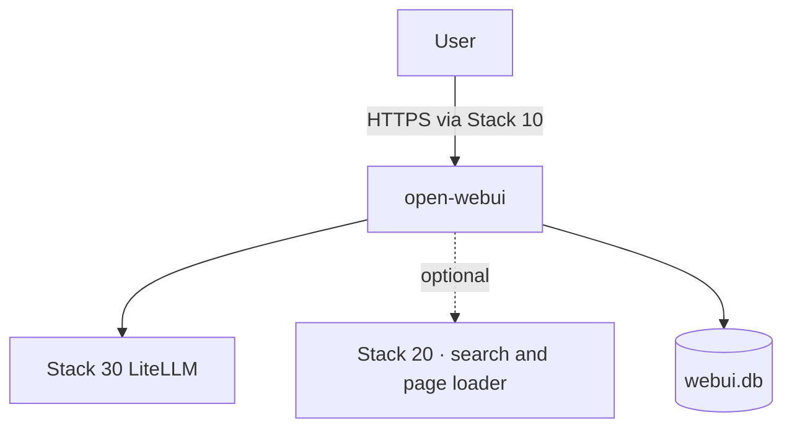

<!--
This Source Code Form is subject to the terms of the Mozilla Public
License, v. 2.0. If a copy of the MPL was not distributed with this
file, You can obtain one at https://mozilla.org/MPL/2.0/.
-->

# Stack 70 — Open WebUI

[Reading guide](../README.md#reading-guide) · [Operations](../docs/operations.md) · Next: [Stack 60 · Hermes](../stack-60_-_hermes/README.md)

The chat interface. It uses LiteLLM for models and, when available, Stack 20 for web search and page loading.



| | |
| --- | --- |
| Install requires | Stacks 00 and 30 prepared, **`litellm` running**, and `OPENWEBUI_LITELLM_API_KEY` (written by Stack 30 install) |
| Containers | `open-webui` (Compose project `Stack7 - Open WebUI`) |
| Published at | `chat.casa.lan` through Stack 10 |
| Runtime data | `${BASE_PATH}/service_-_open-webui/data` (**back up**: users, chats, settings); `OPENWEBUI_SECRET_KEY` in `.env` |
| `status` | Container `/health` (not a test of the LiteLLM key or the models) |

## Lifecycle specifics

- **`install`** runs `00-bootstrap.py` first. It fills only missing Open WebUI values in `.env` (for example the signing key), after a private backup. It never creates LiteLLM keys.
- **`start`** keeps the saved LiteLLM key in sync. Open WebUI stores its connection key in `webui.db`, and that stored key overrides Compose. If it differs from `.env`, `start` stops the container, backs up `webui.db`, replaces only that key, and starts again. An unknown database layout stops the start instead of resetting settings.
- **`reconfig`** previews connection and model-policy drift without changes. `reconfig --apply` never stops or starts containers: with Open WebUI stopped, it backs up `webui.db` and synchronizes a changed LiteLLM key from `.env`; with Open WebUI running and the key already current, it reconciles model policy through the application's ORM. If a running instance has a stale key, stop it manually, run `reconfig --apply`, start it manually, then preview and apply policy.

## Model policy

Compose sets `DEFAULT_MODELS=basic_autorouter`, disables Arena models, and enables web search. After the first administrator signs up, apply and check the policy:

```bash
sudo python3 -B reconcile-model-policy.py   # create/activate basic_autorouter, web_search on by default, readable by all users
sudo python3 -B verify-model-policy.py      # read-only check
```

Both report `DEFER` while no administrator exists. `wait-ready.py` waits for the container to become healthy after `start`.

Files: `docker-compose.yml`, `00-bootstrap.py`, `01-prepare.py`, `reconcile-model-policy.py`, `verify-model-policy.py`, `wait-ready.py`.
