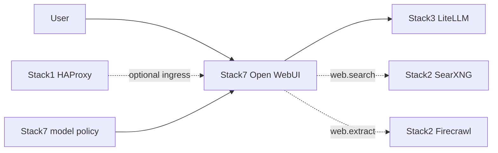

<!--
This Source Code Form is subject to the terms of the Mozilla Public
License, v. 2.0. If a copy of the MPL was not distributed with this
file, You can obtain one at https://mozilla.org/MPL/2.0/.
-->

# Stack 70 — Open WebUI

[Stack operations](../docs/operations.md) · [All stacks](../README.md#stacks-and-dependencies)

Stack7 is the curated user chat surface. It consumes the Stack3 AI gateway, can consume Stack2 local web capabilities and may be published through Stack1 ingress. Model access is explicit rather than globally bypassed.



## Contract

- **Requires:** Stack0 and Stack3.
- **Optional:** Stack1 ingress and Stack2 web capabilities.
- **Default model:** `basic_autorouter`.
- **Access policy:** Arena disabled; `basic_autorouter` receives explicit public-read access; global access bypass remains disabled.
- **Web behaviour:** new chats start with web search enabled when the capability exists, while users retain the ability to disable it.
- **DR:** `/app/backend/data` is persistent sensitive state and is archived; `OPENWEBUI_SECRET_KEY` is persistent installation identity in protected configuration.

## Initial preparation

Run `./local-ai stack-70 install` from the repository root after Stack0 and Stack3 are prepared and LiteLLM is running. `install` does not start Open WebUI. If `stack-70_-_open-webui/.lock` already exists, it changes nothing and shows `./local-ai stack-70 start`; remove the lock only after reviewing the impact of reconfiguration.

Without a lock, the wrapper first creates only Stack 70's service directories using the scoped platform bootstrap, then calls its own `00-bootstrap.py` and `01-prepare.py`. The stack bootstrap keeps existing values and fills only missing or placeholder values in the protected root `.env`. Before any change, it saves the original bytes in a root-owned, mode-0600 `.env-backup-YYMMDD-HHMMSS` file, ignored by Git. Keep this backup protected because it may contain other secrets.

Bootstrap does not issue a LiteLLM key. Stack 30 install writes the dedicated `OPENWEBUI_LITELLM_API_KEY` to the protected root `.env`; prepare this stack after Stack 30 install. Compose passes that key to Open WebUI as `OPENAI_API_KEY`. Once preparation succeeds, use the `./local-ai stack-70 start` command printed by the wrapper.

Open WebUI persists connection keys in its own SQLite configuration, which normally overrides Compose environment values after first launch. On `start`, the wrapper checks the saved LiteLLM endpoint and, if its key differs from the root `.env`, stops only Open WebUI, backs up `webui.db` privately, updates that one key, then starts the container. Other GUI settings and connections remain intact. An unfamiliar database schema or ambiguous LiteLLM endpoint aborts startup rather than resetting all settings. Keep the `webui.db-backup-*` files protected and include them in backup retention planning.

`./local-ai stack-70 start` runs `docker compose up -d` after checking `.lock`; `./local-ai stack-70 stop` runs `docker compose down` without `--volumes`. Stop removes the container but preserves bind-mounted Open WebUI data and `.lock`. Start does not run `wait-ready.py` or reconcile/verify model policy, so a successful Compose exit is not a READY result.

`./local-ai stack-70 status` reports the container's `/health` result from Compose. This tests the WebUI process, not the LiteLLM key scope or model policy; `status --deep` currently has no additional probe. Run the separate policy verifier when that contract matters.

## Policy lifecycle

Model-policy reconciliation is separate from the wrapper lifecycle. Before the first real administrator exists, reconciliation may report a deferred/bootstrap-safe state. After an administrator exists, run reconciliation and verification explicitly to check the declared access/default-feature policy.

From the stack directory, the dedicated programs are:

```bash
sudo python3 -B reconcile-model-policy.py
sudo python3 -B verify-model-policy.py
```

The reconciler ensures `basic_autorouter` is active, explicitly readable and configured with `web_search` in its default feature identifiers. Verification is read-only and checks the same contract.

## Optional web capability

Stack 20 is not a required dependency. Without a READY provider, Stack 70 must not silently route web requests to an undeclared external provider. Once Stack 20 is ready, configure and verify local web integration separately; the wrapper does not do this.

## Security invariants

- Model access is granted explicitly; global bypass stays disabled.
- Persistent Open WebUI identity/state is included in its recovery contract.
- AI provider credentials remain behind Stack3; Stack7 receives scoped gateway access.
- Optional web capability is local and explicit rather than an implicit cloud fallback.
- The wrapper does not enforce model policy; run the separate reconciliation and verification programs when needed.

Key implementation files: `docker-compose.yml`, `00-bootstrap.py`, `01-prepare.py`, `wait-ready.py`, and the model-policy reconcile/verify programs.
