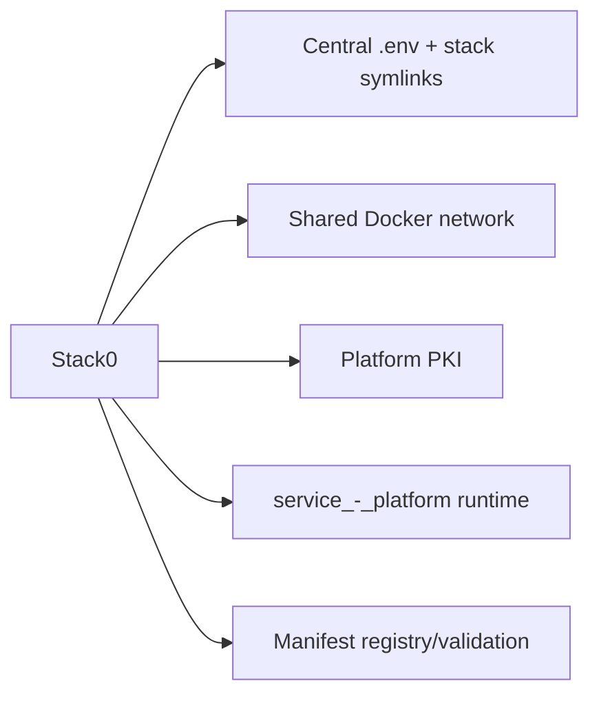
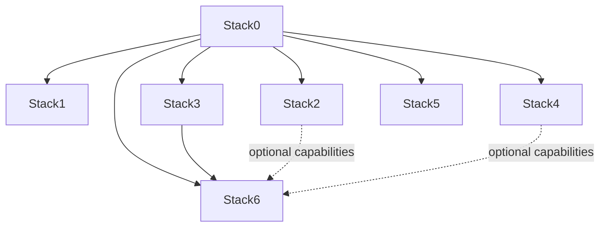
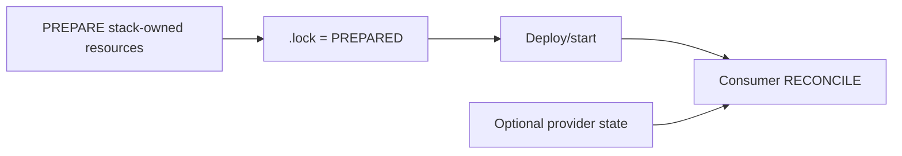

# Stack0 — Platform foundation

Stack0 is the mandatory host/platform foundation. It runs no application container; it establishes and validates the shared contracts required by every deployable stack.

## What Stack0 owns



Manifest capabilities: `platform.foundation`, `platform.environment`, `platform.network`, `platform.pki`.

Owned resources include the root environment contract, stack `.env` compatibility links, `redlocal` and `runtime:service_-_platform`. Stack0 does not own application databases, application volumes, Gitea repositories or Hermes identities.

## Runtime

```text
${BASE_PATH}/service_-_platform/
├── pki/
│   ├── tls.crt
│   └── tls.key
├── state/
└── logs/
```

The `local-hybrid-pki` group uses `PLATFORM_PKI_GID` (default 1999). PKI directory permissions are `root:<PKI GID> 0750`, certificate `0644`, private key `0640`. HAProxy consumes this directory read-only with the supplementary group.

Existing valid PKI is preserved; preparation never rotates it implicitly.

## Preparation

```bash
cd /opt/docker/stacks/stack0_-_platform
sudo ./install.sh
```

Preparation validates the root `.env`, creates/validates `stackN/.env -> ../.env`, prepares platform runtime, creates/validates the shared bridge network, establishes PKI and validates both current and target manifest graphs. `.lock` means PREPARED only.

## Dependency graph



Every application stack requires Stack0. Stack6 additionally requires Stack3. Stack2 and Stack4 are optional providers to Stack6.

## Manifest registry

Each `stackN_-_*` directory must contain `manifest.json`. `manifests.py` discovers stacks rather than maintaining a hard-coded table.

It validates:

- schema version, ID and directory identity;
- required/optional dependency references;
- current and target dependency cycles;
- atomic flag and declared blockers;
- non-empty capability/ownership entries and duplicates;
- global ownership collisions;
- required consumed capabilities are provided inside required dependency closure;
- optional consumed capabilities are reachable through required/optional dependency closure.

Useful commands:

```bash
python3 manifests.py validate
python3 manifests.py validate --target
python3 manifests.py list
python3 manifests.py plan 3
python3 manifests.py plan 6
python3 manifests.py plan all
```

`plan 6` resolves Stack0 -> Stack3 -> Stack6. Required dependencies are recursively ordered and de-duplicated.

`target_requires` remains part of the schema for future architecture transitions, but current atomic stacks already have their intended required dependencies.

## PREPARE versus capability reconciliation

Stack0 validates dependency/capability declarations; it does not reconcile application configuration itself.



The future common installer should use the manifest graph to determine install order and use capability declarations to determine which prepared consumers need reconciliation after provider changes.

## PKI lifecycle

```bash
sudo ./pki.sh status
sudo ./pki.sh create
sudo ./pki.sh renew
sudo ./pki.sh recreate --yes
sudo ./pki.sh delete --yes
```

`renew` preserves the private key. `recreate` replaces certificate and key and requires explicit confirmation. HAProxy must be deliberately reloaded/recreated before it serves changed certificate material.

## Verification

```bash
sudo ./verify.sh
python3 manifests.py validate
python3 manifests.py validate --target
```

Stack0 should be considered healthy only when the shared environment/network/PKI contracts validate; the presence of `.lock` alone is not a health signal.
