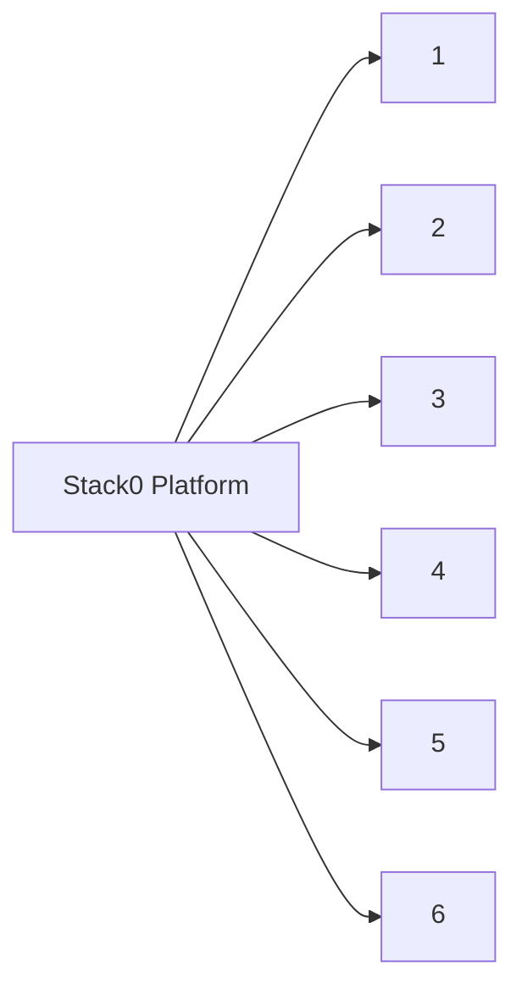

# Stack0 — Platform foundation

[Home](../README.md) · [Install](../INSTALLATION.md) · [DR](../bkp-dr/README.md) · [Pending](../pending.md)

Stack0 is mandatory shared foundation. It owns central environment compatibility links, shared Docker network `redlocal`, platform runtime/PKI and manifest validation; it does not own application runtime.

PREPARE creates/validates only Stack0-owned resources and must preserve existing PKI identity. `.lock` means PREPARED only. The platform PKI is a managed DR identity restored before preparation; real backup + isolated restore verification has passed. See [`../bkp-dr/STATUS.md`](../bkp-dr/STATUS.md).

Executable truth: [`manifest.json`](manifest.json), [`01-prepare.sh`](01-prepare.sh), [`manifests.py`](manifests.py), [`pki.sh`](pki.sh), [`verify.sh`](verify.sh).
