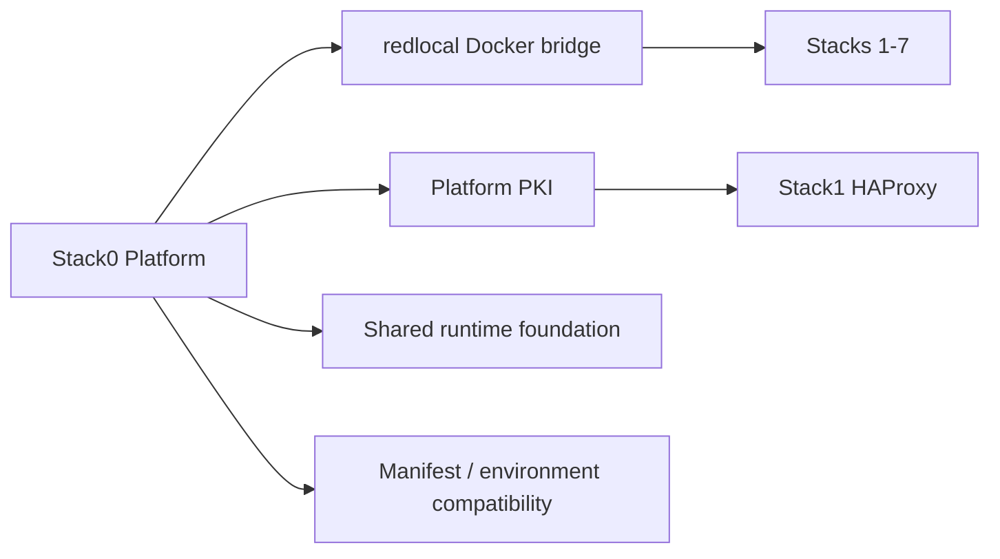

<!--
This Source Code Form is subject to the terms of the Mozilla Public
License, v. 2.0. If a copy of the MPL was not distributed with this
file, You can obtain one at https://mozilla.org/MPL/2.0/.
-->

# Stack0 — Platform foundation

[Documentation TOC](../docs/TOC.md) · [Stack map](../docs/stacks/README.md) · [OpenSpec contract](../docs/devel-docs/openspec/stacks/stack0.feature)

Stack0 is the mandatory foundation for every other stack. It owns shared platform resources instead of letting application stacks duplicate or mutate them independently.

## Contract

- **Requires:** none.
- **Provides:** shared platform foundation.
- **Owns:** `redlocal`, platform PKI/runtime prerequisites and common manifest/environment compatibility plumbing.
- **Persistent DR state:** platform PKI and other explicitly declared Stack0 recovery artifacts.
- **Lifecycle:** establish shared prerequisites before dependent stack deployment, then verify foundation invariants.

Stack0 has no ordinary application container whose running state represents the stack. For that reason selective runtime `start/stop` is not meaningful for Stack0 and the management CLI rejects it rather than pretending there is a container lifecycle to manage.

`.lock` means **PREPARED only**. It records successful preparation of the shared foundation; it is not a substitute for runtime/health verification of dependent stacks.

## Ownership invariants

Application stacks consume Stack0 resources but do not take ownership of them. In particular, Stack1 consumes PKI read-only and all containerized stacks attach to `redlocal` under their own manifests.

The protected root `.env` is installation-owned operational configuration. PREPARE validates it and stack-specific environment linkage, but must not silently regenerate or overwrite it.

## Related decisions

- [ADR-0001 — backup operational environment](../docs/devel-docs/adr/0001-backup-operational-env.md)
- [ADR-0002 — single management CLI](../docs/devel-docs/adr/0002-single-management-cli.md)
- [SDR-0001 — protected operational config in backups](../docs/devel-docs/sdr/0001-protected-operational-config-in-backups.md)
- [Installation lifecycle](../docs/installation.md)
- [Disaster recovery](../docs/dr/README.md)

Key implementation files: `manifest.json`, `01-prepare.sh`, `pki.sh`, `manifests.py`, and `verify.sh`.
