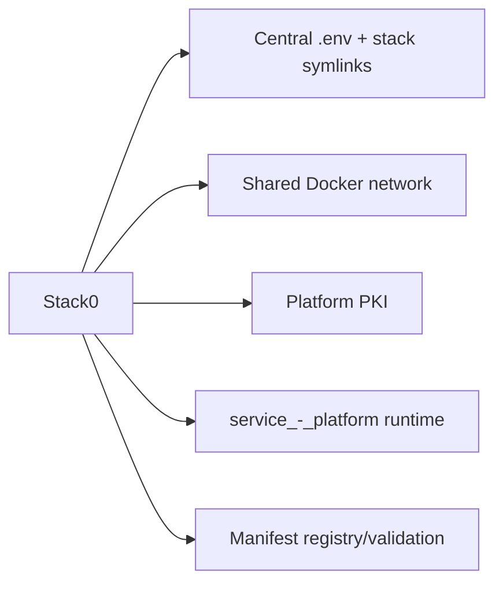
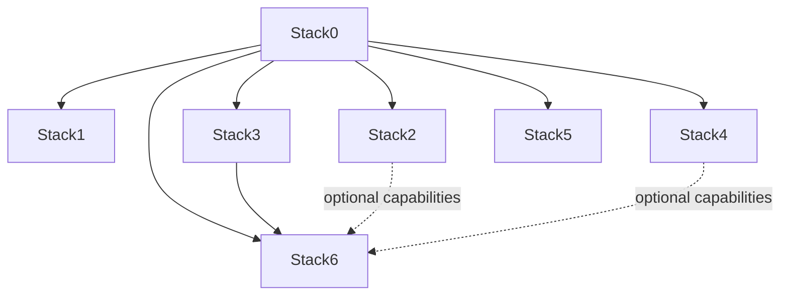
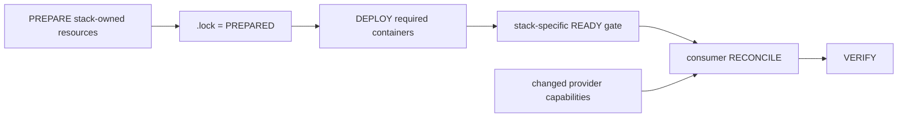

# Stack0 — Platform foundation

Stack0 is the mandatory host/platform foundation. It runs no application container; it establishes and validates the shared contracts required by every deployable stack.

## What Stack0 owns



Manifest capabilities: `platform.foundation`, `platform.environment`, `platform.network`, `platform.pki`.

Owned resources include the root environment contract, stack `.env` compatibility links, `redlocal` and `runtime:service_-_platform`. Stack0 does not own application databases, application volumes, Gitea repositories or Hermes identities.

## Runtime

```text
${BASE_PATH}/service_-_platform/
├── pki/
│   ├── tls.crt
│   └── tls.key
├── state/
└── logs/
```

The `local-hybrid-pki` group uses `PLATFORM_PKI_GID` (default 1999). PKI directory permissions are `root:<PKI GID> 0750`, certificate `0644`, private key `0640`. HAProxy consumes this directory read-only with the supplementary group.

Existing valid PKI is preserved; preparation never rotates it implicitly.

## Disaster recovery

The platform PKI is a managed persistent identity. Full disaster recovery must preserve it so rebuilt clients/services can continue using the same trust chain.

Target manifest semantics:

```json
{
  "recovery": {
    "contract": {
      "schema_version": 1,
      "mode": "mixed"
    },
    "resources": [
      {
        "id": "platform-pki",
        "class": "persistent-identity",
        "strategy": "archive",
        "sensitive": true,
        "config": {
          "source": {
            "type": "runtime-path",
            "path": "${BASE_PATH}/service_-_platform/pki"
          },
          "restore": {
            "phase": "pre-prepare"
          }
        }
      }
    ]
  }
}
```

The future recovery engine must restore this bounded identity before Stack0 PREPARE rather than silently creating a new PKI and treating it as equivalent. See [`../dr-howto.md`](../dr-howto.md) and [`../recovery.schema.json`](../recovery.schema.json).

The operational root `.env` is a protected global recovery prerequisite, not a Stack0-managed backup resource.

## Preparation

```bash
cd /opt/docker/stacks/stack0_-_platform
sudo ./install.sh
```

Preparation validates the root `.env`, creates/validates `stackN/.env -> ../.env`, prepares platform runtime, creates/validates the shared bridge network, establishes PKI and validates both current and target manifest graphs. `.lock` means PREPARED only.

For platform-wide installation use the root common installer instead of this stack-local wrapper:

```bash
cd /opt/docker/stacks
python3 install.py all --plan
sudo python3 install.py all --yes
```

## Dependency graph



Every current application stack requires Stack0. Stack6 additionally requires Stack3. Stack2 and Stack4 are optional providers to Stack6.

A new Open WebUI stack is planned next. Stack0's resolver should discover it dynamically from its manifest; do not add a hard-coded Stack7/Open-WebUI table to `manifests.py`.

## Manifest registry

Each `stackN_-_*` directory must contain `manifest.json`. `manifests.py` discovers stacks rather than maintaining a hard-coded table.

It currently validates:

- schema version, ID and directory identity;
- required/optional dependency references;
- current and target dependency cycles;
- atomic flag and declared blockers;
- non-empty capability/ownership entries and duplicates;
- global ownership collisions;
- required consumed capabilities are provided inside required dependency closure;
- optional consumed capabilities are reachable through required/optional dependency closure.

`recovery.schema.json` now defines the future normalized manifest `recovery` object. Recovery validation/integration in `manifests.py` belongs to the next engine implementation phase; it is not yet active code.

Useful commands:

```bash
python3 manifests.py validate
python3 manifests.py validate --target
python3 manifests.py list
python3 manifests.py plan 3
python3 manifests.py plan 6
python3 manifests.py plan all
```

`plan 6` resolves Stack0 -> Stack3 -> Stack6. Required dependencies are recursively ordered and de-duplicated.

`target_requires` remains part of the schema for future architecture transitions, but current atomic stacks already have their intended required dependencies.

## Common installer and lifecycle states

The common installer is now implemented at repository root (`install.py`). It consumes the manifest graph, observes current state, invokes stack-owned lifecycle commands from `installer/lifecycle.json`, and reconciles affected optional consumers generically when a provider actually changes.



Important distinctions:

- `.lock` means PREPARED only;
- required containers running means DEPLOYED, not necessarily READY;
- a provider-specific readiness gate must pass before capability-dependent consumers are reconciled;
- a healthy requested provider does not count as a capability change;
- `--reconcile` is the explicit operator override for intentional reconciliation.

Stack2 currently demonstrates the readiness pattern through `02-wait-ready.sh` before `web.search`/`web.extract` are treated as usable for Stack6 reconciliation.

## PKI lifecycle

```bash
sudo ./pki.sh status
sudo ./pki.sh create
sudo ./pki.sh renew
sudo ./pki.sh recreate --yes
sudo ./pki.sh delete --yes
```

`renew` preserves the private key. `recreate` replaces certificate and key and requires explicit confirmation. HAProxy must be deliberately reloaded/recreated before it serves changed certificate material.

## Verification

```bash
sudo ./verify.sh
python3 manifests.py validate
python3 manifests.py validate --target
```

Stack0 should be considered healthy only when the shared environment/network/PKI contracts validate; the presence of `.lock` alone is not a health signal.
