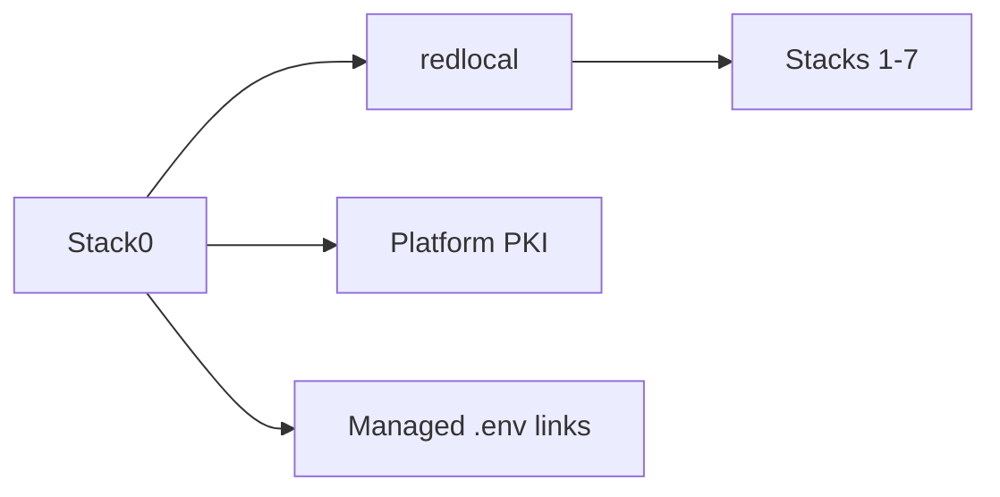

# Stack0 — Platform foundation

Mandatory base for every stack. Owns the shared Docker bridge, platform PKI/runtime foundation and manifest/environment compatibility plumbing.

**Requires:** none.  
**Provides:** platform foundation.  
**Persistent DR state:** platform PKI.  
**Lifecycle:** prepare shared prerequisites, then verify foundation invariants.

Key files: `manifest.json`, `01-prepare.sh`, `pki.sh`, `manifests.py`, `verify.sh`.

See [../docs/installation.md](../docs/installation.md) and [../docs/dr/howto.md](../docs/dr/howto.md).
