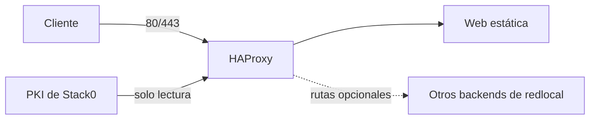

# Stack1 — HAProxy + Web

Stack1 es el stack de entrada y web estática. Requiere únicamente Stack0 y proporciona `ingress.https` y `web.static`.



## Propiedad y dependencias

Stack0 posee `redlocal` y `${BASE_PATH}/service_-_platform/pki`. Stack1 posee los contenedores `haproxy`/`web` y los runtimes `service_-_haproxy`/`service_-_web`.

Los demás stacks son backends opcionales desde el punto de vista de instalación de Stack1. HAProxy usa DNS de Docker con `init-addr last,none`, por lo que puede arrancar aunque un backend no esté disponible.

Stack1 no genera ni copia claves TLS. HAProxy monta el directorio PKI de Stack0 como solo lectura y recibe el GID suplementario configurado para PKI.

## Preparación

```bash
cd /opt/docker/stacks/stack1_-_haproxy_web
sudo ./01-prepare.sh
```

PREPARE valida lock/red/PKI de Stack0, conserva la identidad de los directorios runtime ya montados, sincroniza configuración y contenido gestionados, valida HAProxy y Compose y finalmente crea `.lock`.

`.lock` significa únicamente PREPARED.

## Arranque

```bash
docker compose up -d
docker compose ps
docker compose logs -f haproxy
```

Actualizar archivos no recarga el proceso HAProxy. Los cambios de configuración, mounts, grupos suplementarios o certificados deben aplicarse mediante recarga/recreación controlada. El contenido web estático puede actualizarse sin recrear `web`.

## PKI

El ciclo de vida pertenece exclusivamente a Stack0:

```bash
sudo ../stack0_-_platform/pki.sh status
sudo ../stack0_-_platform/pki.sh renew
sudo ../stack0_-_platform/pki.sh recreate --yes
```

Montar el directorio PKI completo permite que archivos sustituidos sean visibles dentro del contenedor, pero HAProxy necesita recarga/recreación para empezar a servir un certificado renovado.

## Re-preparación

```bash
rm .lock
sudo ./01-prepare.sh
```

Eliminar `.lock` es una operación explícita de mantenimiento, no el mecanismo normal para actualizar Git o para que aparezca/desaparezca un backend opcional.

## Seguridad

No almacenar claves TLS privadas en Stack1 ni copiarlas a `service_-_haproxy`. El `.env` operacional y el material PKI privado permanecen fuera de Git.
