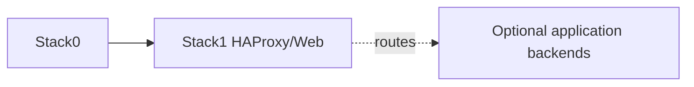

# Stack1 — HAProxy + Web

[Home](../README.md) · [Install](../INSTALLATION.md) · [DR](../bkp-dr/README.md) · [Pending](../pending.md)

Stack1 owns ingress/static-web runtime. It requires Stack0 only. Application backends exposed through HAProxy remain owned by their application stacks; Stack1 must not create hidden dependencies merely because it can route to them.

DR classification: **reconstructable**. No Stack1 runtime data is currently a managed backup resource. Use [`manifest.json`](manifest.json) and the stack scripts/Compose configuration as executable truth.
