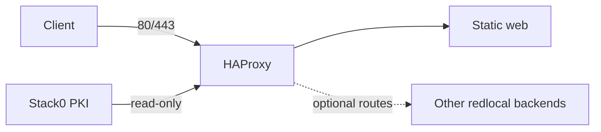

# Stack1 — HAProxy + Web

Stack1 is the ingress/static-web stack. It requires only Stack0 and provides `ingress.https` and `web.static`.



## Ownership and dependencies

Stack0 owns `redlocal` and `${BASE_PATH}/service_-_platform/pki`. Stack1 owns containers `haproxy`/`web` and runtimes `service_-_haproxy`/`service_-_web`.

Backend stacks are optional from Stack1's installation perspective. HAProxy uses Docker DNS with `init-addr last,none`, allowing ingress to start while a routed backend is absent.

Stack1 never generates/copies TLS private material. HAProxy mounts the Stack0 PKI directory read-only and receives the configured PKI supplementary GID.

## Preparation

```bash
cd /opt/docker/stacks/stack1_-_haproxy_web
sudo ./01-prepare.sh
```

PREPARE validates the Stack0 lock/network/PKI, preserves existing bind-mounted runtime directories, synchronizes managed HAProxy/static content, validates HAProxy and Compose, then creates `.lock`.

`.lock` means PREPARED only. Existing runtime directories are not replaced, so a running bind mount keeps the same directory identity.

## Start

```bash
docker compose up -d
docker compose ps
docker compose logs -f haproxy
```

Updating HAProxy source files does not reload the running process. Apply a controlled reload/recreation when configuration, mounts, supplementary groups or certificate material require it. Static web content can be updated without recreating `web`.

## PKI lifecycle

PKI belongs exclusively to Stack0:

```bash
sudo ../stack0_-_platform/pki.sh status
sudo ../stack0_-_platform/pki.sh renew
sudo ../stack0_-_platform/pki.sh recreate --yes
```

Mounting the whole PKI directory ensures replacement files become visible inside the container, but HAProxy still needs a controlled reload/recreation to begin serving a renewed certificate.

## Re-preparation

Removing `.lock` and rerunning PREPARE is an explicit maintenance operation:

```bash
rm .lock
sudo ./01-prepare.sh
```

Do this only when preparation itself must be repeated. Normal Git updates or optional backend changes do not inherently require deleting the lock.

## Security boundary

Do not store TLS private keys in Stack1 source or copy them into `service_-_haproxy`. The operational `.env` and PKI private material remain outside Git.
