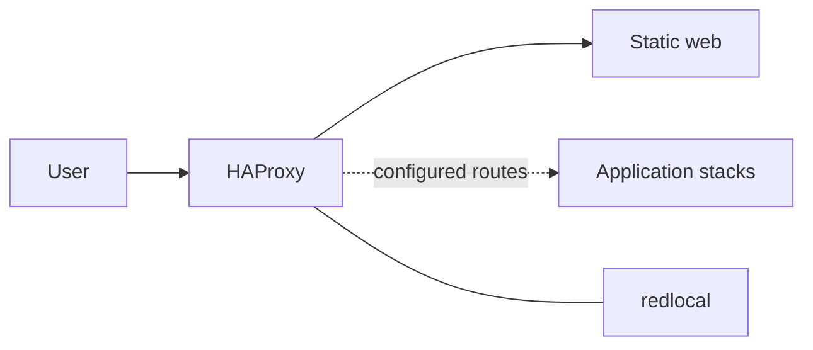

# Stack1 — HAProxy + Web

Owns user-facing HTTP ingress and the small static landing page. Application backends remain owned by their own stacks.

**Requires:** Stack0.  
**Provides:** ingress/web.  
**DR:** reconstructable; no durable Stack1 artifact.  
**Security boundary:** backends should normally stay on `redlocal` instead of publishing host ports.

Key files: `docker-compose.yml`, `config/haproxy/haproxy.cfg`, `manifest.json`.
