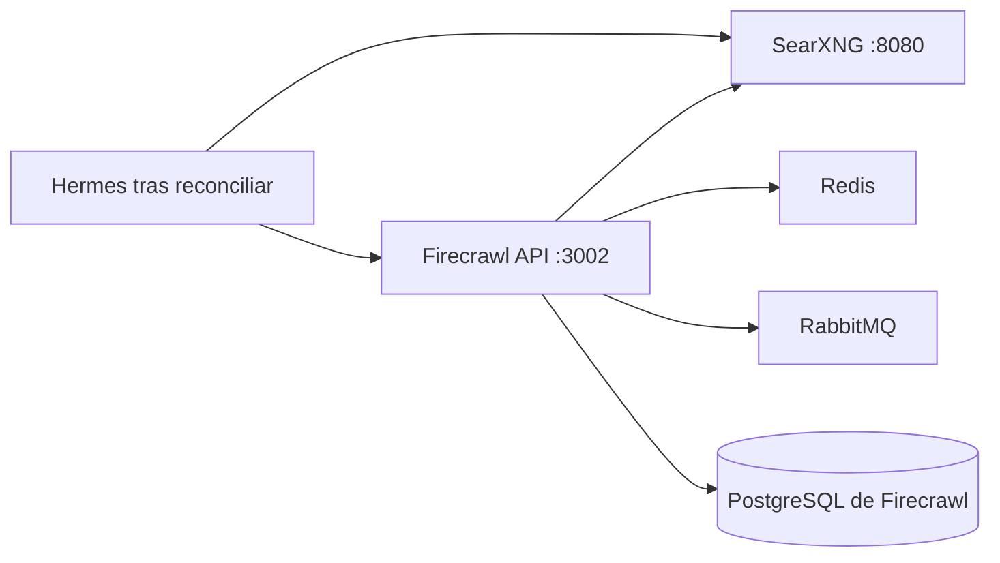
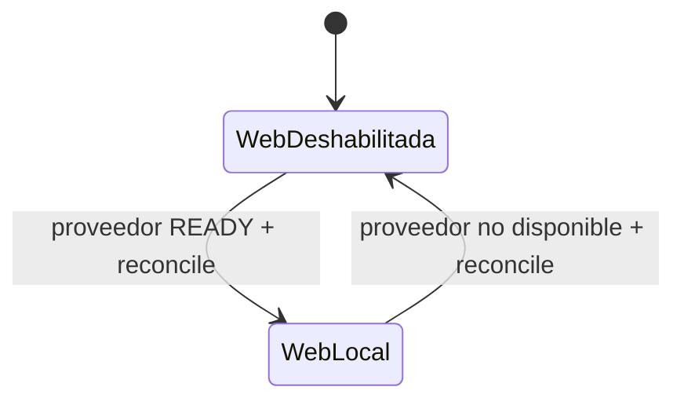

# Stack2 — SearXNG + Firecrawl

Stack2 proporciona las capacidades locales de búsqueda y extracción web. Es atómico, requiere únicamente Stack0 y proporciona `web.search` y `web.extract`.



Ningún servicio de Stack2 publica directamente su puerto de aplicación en el host. SearXNG puede exponerse mediante Stack1/HAProxy; Firecrawl y sus servicios auxiliares permanecen internos a `redlocal`.

## Propiedad y persistencia

Stack2 posee SearXNG, Firecrawl API, Playwright, Redis, RabbitMQ y su PostgreSQL, además de sus runtimes declarados en el manifest. No posee `redlocal`; la red pertenece a Stack0.

```text
${BASE_PATH}/service_-_searxng/config
${BASE_PATH}/service_-_searxng/data
${BASE_PATH}/service_-_firecrawl-redis/data
${BASE_PATH}/service_-_firecrawl-rabbitmq/data
${BASE_PATH}/service_-_firecrawl-postgres/data
${BASE_PATH}/service_-_firecrawl-postgres/secret/postgres_admin_password
```

PREPARE conserva la identidad del directorio de configuración SearXNG y los directorios persistentes. Sincroniza la configuración gestionada sin sustituir un directorio bind ya utilizado por un contenedor.

El PostgreSQL de Firecrawl pertenece exclusivamente a Stack2. LiteLLM ya no usa esa base de datos.

PREPARE no hace `chown -R` ni normaliza permisos sobre un PGDATA existente. Preserva su ownership y modo actuales. En un runtime nuevo, crea únicamente el directorio vacío y deja que el entrypoint oficial de PostgreSQL establezca su identidad durante `initdb`.

## Modelo de identidades PostgreSQL

Stack2 separa explícitamente la identidad administrativa de PostgreSQL de la identidad usada por Firecrawl en operación normal.

```text
firecrawl-postgres / database postgres
|
+-- postgres
|   rol administrativo/bootstrap
|   propietario de NUQ/cron/extensiones
|   password fuera de .env:
|   ${BASE_PATH}/service_-_firecrawl-postgres/secret/postgres_admin_password
|
+-- firecrawl
    rol aplicativo
    no superuser / sin CREATEDB / sin CREATEROLE / sin replication
    password: FIRECRAWL_DB_PASSWORD en el .env operacional protegido
    database: postgres
```

La base continúa llamándose `postgres` porque la imagen upstream de NUQ configura `pg_cron` sobre esa base. La separación de seguridad se realiza mediante **roles**, no creando una segunda base.

En una instalación nueva, PREPARE genera una sola vez el password administrativo de `postgres` como secreto runtime de Stack2. Durante el primer `initdb`, `config/postgres/020-firecrawl-app-role.sh` crea/reconcilia el rol aplicativo después de que el `010-nuq.sql` upstream haya creado los objetos NUQ. Firecrawl recibe acceso CRUD al schema `nuq` pero ningún privilegio administrativo de PostgreSQL. También se configuran privilegios por defecto para futuros objetos NUQ creados por `postgres`.

El contrato aplicativo es:

```text
FIRECRAWL_DB_NAME=postgres
FIRECRAWL_DB_USER=firecrawl
FIRECRAWL_DB_PASSWORD=<password aplicativo persistente>
```

Firecrawl no debe utilizar el rol `postgres` durante operación normal.

### Instalaciones existentes

Los despliegues anteriores a esta separación tienen `POSTGRES_PASSWORD` en el `.env` raíz y Firecrawl se conecta como `postgres`. Se migran explícitamente; PREPARE no modifica silenciosamente una identidad de base de datos viva.

Después de añadir las nuevas variables `FIRECRAWL_DB_*` al `.env` operacional protegido:

```bash
sudo bash ./03-migrate-postgres-app-role.sh
```

La migración:

1. adopta una sola vez el `POSTGRES_PASSWORD` actual en el fichero runtime `postgres_admin_password`, sin imprimirlo;
2. crea/reconcilia el rol `firecrawl` y los grants mínimos;
3. establece privilegios por defecto para futuros objetos NUQ;
4. valida que el rol no conserva atributos administrativos;
5. realiza una prueba TCP autenticada con SELECT/INSERT/UPDATE/DELETE dentro de una transacción y aplica `ROLLBACK`;
6. no modifica PGDATA y no reinicia ni recrea contenedores.

Sólo después de que esta migración pase debe aplicarse el nuevo Compose. Una vez validado que Firecrawl se conecta como `firecrawl`, las variables legacy `POSTGRES_USER`, `POSTGRES_PASSWORD` y `POSTGRES_DB` pueden retirarse del `.env` operacional.

## Preparación, despliegue y readiness

```bash
cd /opt/docker/stacks/stack2_-_searxng_firecrawl
sudo ./01-prepare.sh
docker compose up -d
sudo bash ./02-wait-ready.sh
docker compose ps
```

PREPARE exige el `.lock` de Stack0, valida la red bridge compartida sin crearla, prepara recursos propios, asegura que exista el secreto administrativo runtime de PostgreSQL, valida Compose y sólo entonces crea `.lock`.

`.lock` significa PREPARED; no significa desplegado, healthy ni READY.

`docker compose up -d` establece el estado de proceso, pero **DEPLOYED no equivale a READY**. `02-wait-ready.sh` espera, con timeout acotado, hasta que ambos endpoints del proveedor aceptan conexiones:

```text
web.search  -> searxng:8080
web.extract -> firecrawl-api:3002
```

El instalador común ejecuta esta puerta de readiness después del despliegue de Stack2 y de nuevo durante VERIFY. La reconciliación de consumidores sólo se realiza después de que la readiness del proveedor haya pasado correctamente durante una transición.

## Endpoints internos

```text
SearXNG:        http://searxng:8080
Firecrawl API: http://firecrawl-api:3002
PostgreSQL:    firecrawl-postgres:5432
Redis:         firecrawl-redis:6379
RabbitMQ:      firecrawl-rabbitmq:5672
```

PostgreSQL no publica `5432` en el host. El acceso aplicativo se realiza por `redlocal`; para administración desde el host se debe preferir `docker exec` frente a exponer PostgreSQL a la LAN.

## Integración incremental con Stack6

Stack6 no requiere Stack2. Si Stack2 no está READY, las herramientas web de Hermes permanecen explícitamente deshabilitadas.

Operación incremental preferida desde la raíz del repositorio:

```bash
sudo python3 install.py 2 --yes
```

Si Stack2 ya está sano/READY, el instalador lo verifica y no provoca una reconciliación innecesaria de Stack6. Si Stack2 debe desplegarse o recuperarse realmente, el instalador espera su readiness, descubre consumidores preparados mediante las capabilities del manifest y reconcilia Stack6 automáticamente.

Equivalente manual tras desplegar/restaurar Stack2:

```bash
sudo bash ./02-wait-ready.sh
cd /opt/docker/stacks/stack6_-_hermes
sudo ./06-reconcile-capabilities.sh --restart
```

La reconciliación habilita web cuando los proveedores locales están disponibles en la red compartida; durante una transición gestionada por el instalador, además se garantiza su readiness antes de reconciliar. Si el proveedor desaparece, una nueva reconciliación vuelve al estado web deshabilitado y no activa un proveedor externo alternativo.



## Re-preparación

```bash
rm .lock
sudo ./01-prepare.sh
```

Usar únicamente cuando deba repetirse PREPARE. La activación de capacidades opcionales en Stack6 se realiza con reconciliación, sin eliminar el `.lock` de Stack6.
