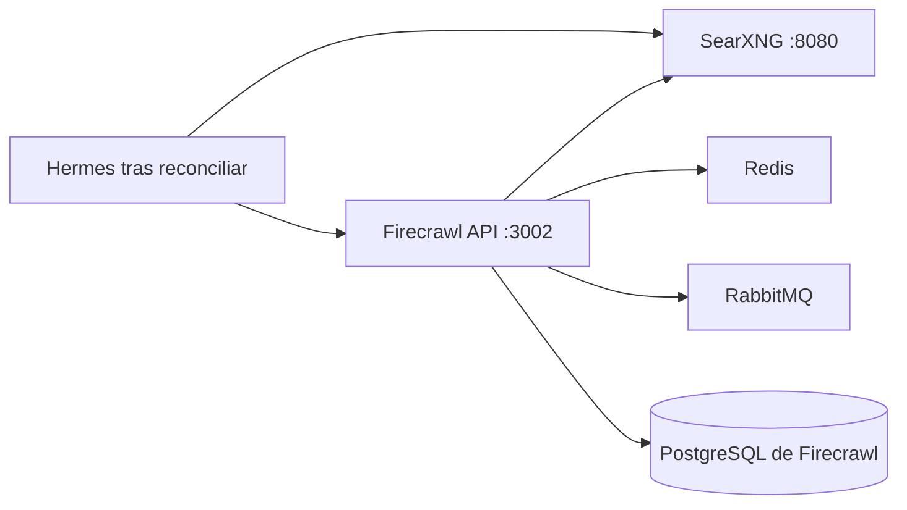
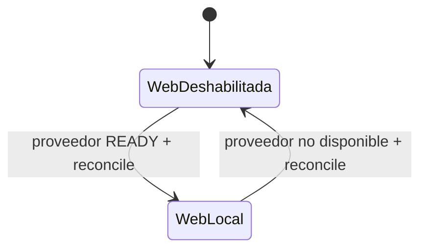

# Stack2 — SearXNG + Firecrawl

Stack2 proporciona las capacidades locales de búsqueda y extracción web. Es atómico, requiere únicamente Stack0 y proporciona `web.search` y `web.extract`.



Ningún servicio de Stack2 publica directamente su puerto de aplicación en el host. SearXNG puede exponerse mediante Stack1/HAProxy; Firecrawl y sus servicios auxiliares permanecen internos a `redlocal`.

## Propiedad y persistencia

Stack2 posee SearXNG, Firecrawl API, Playwright, Redis, RabbitMQ y su PostgreSQL, además de sus runtimes declarados en el manifest. No posee `redlocal`; la red pertenece a Stack0.

```text
${BASE_PATH}/service_-_searxng/config
${BASE_PATH}/service_-_searxng/data
${BASE_PATH}/service_-_firecrawl-redis/data
${BASE_PATH}/service_-_firecrawl-rabbitmq/data
${BASE_PATH}/service_-_firecrawl-postgres/data
```

PREPARE conserva la identidad del directorio de configuración SearXNG y los directorios persistentes. Sincroniza la configuración gestionada sin sustituir un directorio bind ya utilizado por un contenedor.

El PostgreSQL de Firecrawl pertenece exclusivamente a Stack2. LiteLLM ya no usa esa base de datos.

## Preparación, despliegue y readiness

```bash
cd /opt/docker/stacks/stack2_-_searxng_firecrawl
sudo ./01-prepare.sh
docker compose up -d
sudo bash ./02-wait-ready.sh
docker compose ps
```

PREPARE exige el `.lock` de Stack0, valida la red bridge compartida sin crearla, prepara recursos propios, valida Compose y sólo entonces crea `.lock`.

`.lock` significa PREPARED; no significa desplegado, healthy ni READY.

`docker compose up -d` establece el estado de proceso, pero **DEPLOYED no equivale a READY**. `02-wait-ready.sh` espera, con timeout acotado, hasta que ambos endpoints del proveedor aceptan conexiones:

```text
web.search  -> searxng:8080
web.extract -> firecrawl-api:3002
```

El instalador común ejecuta esta puerta de readiness después del despliegue de Stack2 y de nuevo durante VERIFY. La reconciliación de consumidores sólo se realiza después de que la readiness del proveedor haya pasado correctamente durante una transición.

Este comportamiento se validó deteniendo únicamente SearXNG y recuperando Stack2 mediante el instalador común: se reutilizó el mismo contenedor SearXNG, la readiness finalizó antes de reconciliar Stack6, Hermes mantuvo su identidad y una segunda ejecución volvió a convergencia de sólo verificación.

## Endpoints internos

```text
SearXNG:        http://searxng:8080
Firecrawl API: http://firecrawl-api:3002
PostgreSQL:    firecrawl-postgres:5432
Redis:         firecrawl-redis:6379
RabbitMQ:      firecrawl-rabbitmq:5672
```

## Integración incremental con Stack6

Stack6 no requiere Stack2. Si Stack2 no está READY, las herramientas web de Hermes permanecen explícitamente deshabilitadas.

Operación incremental preferida desde la raíz del repositorio:

```bash
sudo python3 install.py 2 --yes
```

Si Stack2 ya está sano/READY, el instalador lo verifica y no provoca una reconciliación innecesaria de Stack6. Si Stack2 debe desplegarse o recuperarse realmente, el instalador espera su readiness, descubre consumidores preparados mediante las capabilities del manifest y reconcilia Stack6 automáticamente.

Equivalente manual tras desplegar/restaurar Stack2:

```bash
sudo bash ./02-wait-ready.sh
cd /opt/docker/stacks/stack6_-_hermes
sudo ./06-reconcile-capabilities.sh --restart
```

La reconciliación habilita web cuando los proveedores locales están disponibles en la red compartida; durante una transición gestionada por el instalador, además se garantiza su readiness antes de reconciliar. Si el proveedor desaparece, una nueva reconciliación vuelve al estado web deshabilitado y no activa un proveedor externo alternativo.



## Re-preparación

```bash
rm .lock
sudo ./01-prepare.sh
```

Usar únicamente cuando deba repetirse PREPARE. La activación de capacidades opcionales en Stack6 se realiza con reconciliación, sin eliminar el `.lock` de Stack6.
