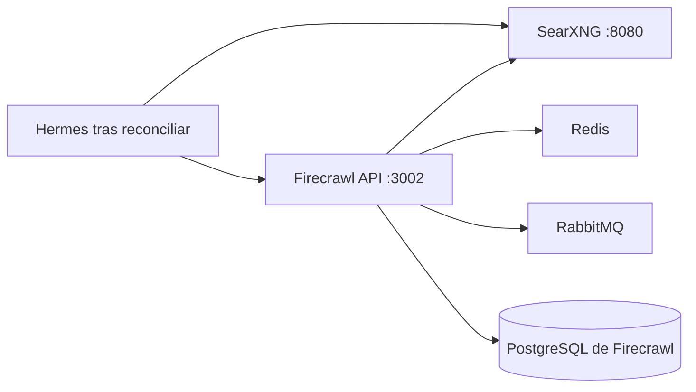
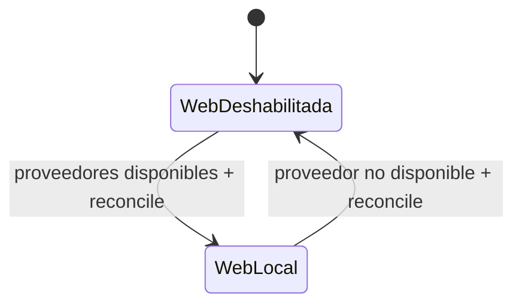

# Stack2 — SearXNG + Firecrawl

Stack2 proporciona las capacidades locales de búsqueda y extracción web. Es atómico, requiere únicamente Stack0 y proporciona `web.search` y `web.extract`.



Ningún servicio de Stack2 publica directamente su puerto de aplicación en el host. SearXNG puede exponerse mediante Stack1/HAProxy; Firecrawl y sus servicios auxiliares permanecen internos a `redlocal`.

## Propiedad y persistencia

Stack2 posee SearXNG, Firecrawl API, Playwright, Redis, RabbitMQ y su PostgreSQL, además de sus runtimes declarados en el manifest. No posee `redlocal`; la red pertenece a Stack0.

```text
${BASE_PATH}/service_-_searxng/config
${BASE_PATH}/service_-_searxng/data
${BASE_PATH}/service_-_firecrawl-redis/data
${BASE_PATH}/service_-_firecrawl-rabbitmq/data
${BASE_PATH}/service_-_firecrawl-postgres/data
```

PREPARE conserva la identidad del directorio de configuración SearXNG y los directorios persistentes. Sincroniza la configuración gestionada sin sustituir un directorio bind ya utilizado por un contenedor.

El PostgreSQL de Firecrawl pertenece exclusivamente a Stack2. LiteLLM ya no usa esa base de datos.

## Preparación y arranque

```bash
cd /opt/docker/stacks/stack2_-_searxng_firecrawl
sudo ./01-prepare.sh
docker compose up -d
docker compose ps
```

PREPARE exige el `.lock` de Stack0, valida la red bridge compartida sin crearla, prepara recursos propios, valida Compose y sólo entonces crea `.lock`. `.lock` significa PREPARED, no running/healthy.

## Endpoints internos

```text
SearXNG:        http://searxng:8080
Firecrawl API: http://firecrawl-api:3002
PostgreSQL:    firecrawl-postgres:5432
Redis:         firecrawl-redis:6379
RabbitMQ:      firecrawl-rabbitmq:5672
```

## Integración incremental con Stack6

Stack6 no requiere Stack2. Si Stack2 no está disponible, las herramientas web de Hermes permanecen explícitamente deshabilitadas.

Después de desplegar o restaurar Stack2:

```bash
cd /opt/docker/stacks/stack6_-_hermes
sudo ./06-reconcile-capabilities.sh --restart
```

La reconciliación habilita web sólo cuando `searxng` y `firecrawl-api` están ejecutándose sobre la red compartida. Si el proveedor desaparece, una nueva reconciliación vuelve al estado web deshabilitado y no activa un proveedor externo alternativo.



## Re-preparación

```bash
rm .lock
sudo ./01-prepare.sh
```

Usar únicamente cuando deba repetirse PREPARE. La activación de capacidades opcionales en Stack6 se realiza con reconciliación, sin eliminar el `.lock` de Stack6.
