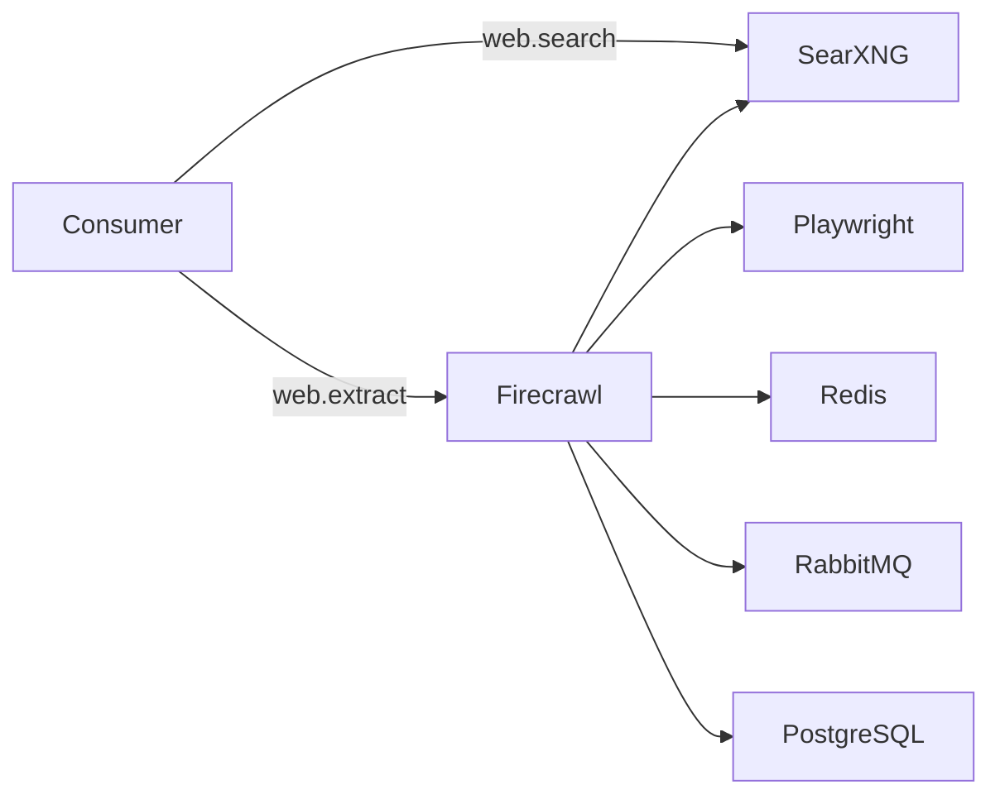

# Stack2 — SearXNG + Firecrawl

Provides local web search and page extraction to AI consumers.

**Requires:** Stack0.  
**Provides:** `web.search`, `web.extract`.  
**Consumers:** Stack6 and Stack7 optionally.  
**DR:** reconstructable; SearXNG cache and Firecrawl DB/queue state are not recovery artifacts.

Internal services stay on `redlocal`. Configuration secrets are described in [../docs/configuration/env-secrets.md](../docs/configuration/env-secrets.md).
