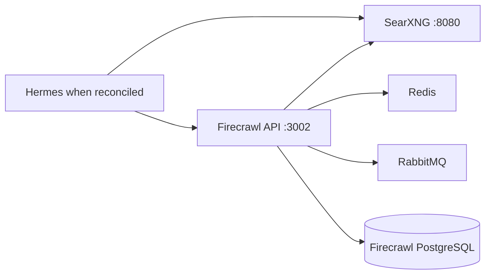
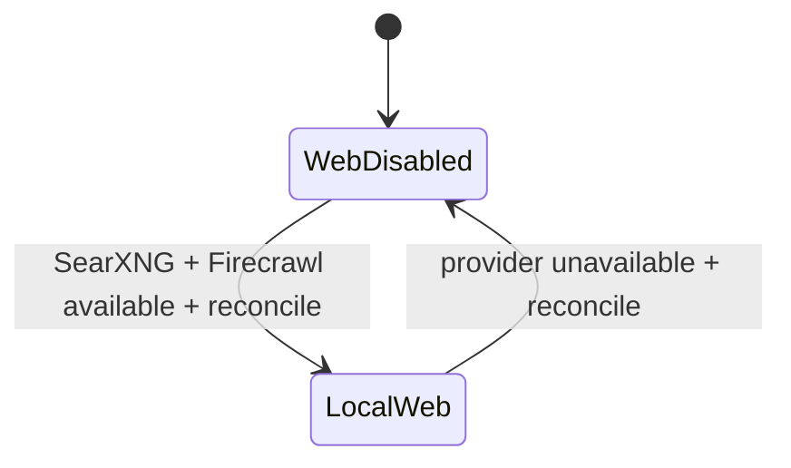

# Stack2 — SearXNG + Firecrawl

Stack2 is the local web search/extraction capability provider. It is atomic, requires only Stack0, and provides `web.search` and `web.extract`.



No Stack2 service publishes an application port directly to the host. SearXNG can be exposed through Stack1/HAProxy; Firecrawl and its supporting services remain internal to `redlocal`.

## Ownership

Stack2 owns six containers: SearXNG, Firecrawl API, Firecrawl Playwright, Redis, RabbitMQ and Firecrawl PostgreSQL. It also owns the corresponding SearXNG and Firecrawl runtime roots declared in its manifest.

It does **not** own `redlocal`; Stack0 creates/validates the shared network.

## Persistence

```text
${BASE_PATH}/service_-_searxng/config
${BASE_PATH}/service_-_searxng/data
${BASE_PATH}/service_-_firecrawl-redis/data
${BASE_PATH}/service_-_firecrawl-rabbitmq/data
${BASE_PATH}/service_-_firecrawl-postgres/data
```

PREPARE preserves the existing SearXNG configuration directory identity and persistent data directories. It synchronizes managed configuration without replacing a live bind-mounted directory.

Firecrawl PostgreSQL belongs only to Stack2. LiteLLM no longer uses this database in the current architecture.

## Preparation and start

```bash
cd /opt/docker/stacks/stack2_-_searxng_firecrawl
sudo ./01-prepare.sh
docker compose up -d
docker compose ps
```

PREPARE requires Stack0 `.lock`, verifies the existing shared bridge network without creating it, prepares stack-owned runtime paths/configuration, validates Compose and creates `.lock` only after success.

`.lock` means PREPARED, not running/healthy.

## Internal endpoints

```text
SearXNG:        http://searxng:8080
Firecrawl API: http://firecrawl-api:3002
PostgreSQL:    firecrawl-postgres:5432
Redis:         firecrawl-redis:6379
RabbitMQ:      firecrawl-rabbitmq:5672
```

## Stack6 integration

Stack6 does not require Stack2. Without Stack2, Hermes web tools remain explicitly disabled.

After deploying/restoring Stack2, reconcile the already-prepared Stack6 consumer:

```bash
cd /opt/docker/stacks/stack6_-_hermes
sudo ./06-reconcile-capabilities.sh --restart
```

Reconciliation enables web only when both `searxng` and `firecrawl-api` are running on the configured shared network. Provider disappearance reverses the configuration to explicit web-disabled state; it does not trigger an external web fallback.



## Re-preparation

```bash
rm .lock
sudo ./01-prepare.sh
```

Use this only when PREPARE itself must be repeated. Optional-capability activation in Stack6 uses reconciliation and does not require re-preparing Stack6.
