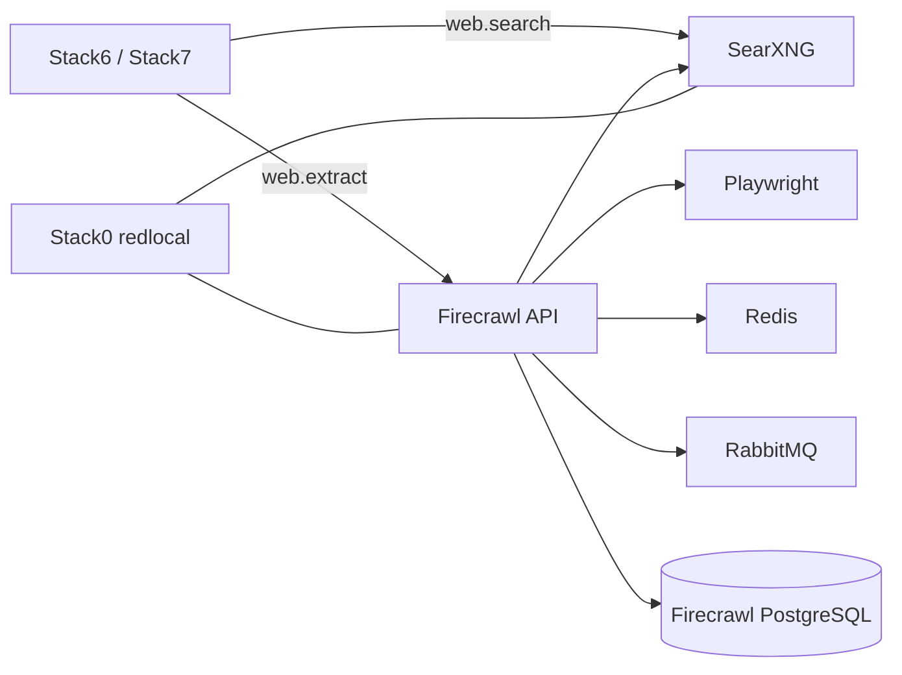

<!--
This Source Code Form is subject to the terms of the Mozilla Public
License, v. 2.0. If a copy of the MPL was not distributed with this
file, You can obtain one at https://mozilla.org/MPL/2.0/.
-->

# Stack2 — SearXNG + Firecrawl

[Documentation TOC](../docs/TOC.md) · [Stack map](../docs/stacks/README.md) · [OpenSpec contract](../docs/devel-docs/openspec/stacks/stack2.feature)

Stack2 provides local web search and page extraction. It is optional for AI consumers: Stack6 and Stack7 can operate without it, but web capabilities remain disabled rather than silently falling back to an external service.

## Contract

- **Requires:** Stack0.
- **Provides:** `web.search` and `web.extract`.
- **Optional consumers:** Stack6 and Stack7.
- **DR:** reconstructable; caches, queue state and Firecrawl database state are not recovery artifacts.
- **Network:** application services remain internal to `redlocal` unless explicitly exposed through Stack1.

`.lock` means **PREPARED only**. Deployment and readiness are separate lifecycle states. The common lifecycle waits for the SearXNG and Firecrawl provider endpoints before optional consumers are reconciled.

## PostgreSQL identity model

Stack2 uses one PostgreSQL cluster and keeps the database name `postgres` because the pinned NuQ image configures `pg_cron` against it. Security separation is therefore performed with roles rather than by moving Firecrawl to another database.

Two identities are intentionally distinct:

- `postgres` — administrative/bootstrap identity used for initialization, ownership, extensions and cron management. Its password lives in runtime secret storage outside the protected root `.env`.
- `firecrawl` — least-privilege application login used by Firecrawl during normal operation. Its credential is installation-owned configuration.

The bootstrap grants only the schema/table/sequence access needed by the application and establishes default privileges for future NuQ objects created by the administrative role.

## Persistent runtime invariants

Persistent directories include SearXNG state and the Firecrawl Redis, RabbitMQ and PostgreSQL runtime areas. PREPARE must preserve existing persistent state. In particular, an initialized PostgreSQL data directory is runtime-owned and must not be recursively `chown`ed, permission-normalized or recreated as a routine repair action.

The administrative PostgreSQL password is generated once for a new runtime and then preserved. Rotating only one side of a persistent database credential contract is not a supported configuration change.

## Capability behaviour

Stack2 is a provider, not a hard dependency of Stack6 or Stack7. If it is absent or not READY, consumers must keep web tools explicitly disabled. Once Stack2 becomes READY, the common installer/reconciliation lifecycle may enable the optional capabilities for prepared consumers.

This relationship is capability-driven; operators should not invoke consumer-specific scripts manually as part of normal lifecycle management.

## Security invariants

- PostgreSQL is reachable through Docker networking, not by an unnecessary host `5432` publication.
- Administrative and application database identities remain separate.
- The administrative database secret stays outside Git and outside the root `.env`.
- Existing PGDATA metadata is preserved during PREPARE.
- Missing Stack2 capability never enables an undeclared external web fallback.
- `./local-ai` is the supported management boundary; Compose and stack scripts are implementation details.

## Related decisions

- [SDR-0004 — internal-only service networking](../docs/devel-docs/sdr/0004-internal-only-service-networking.md)
- [Configuration and secrets](../docs/configuration/env-secrets.md)
- [Installation lifecycle](../docs/installation.md)

Key implementation files: `docker-compose.yml`, `config/searxng/`, `config/postgres/020-firecrawl-app-role.sh`, `manifest.json`, and stack lifecycle scripts.
