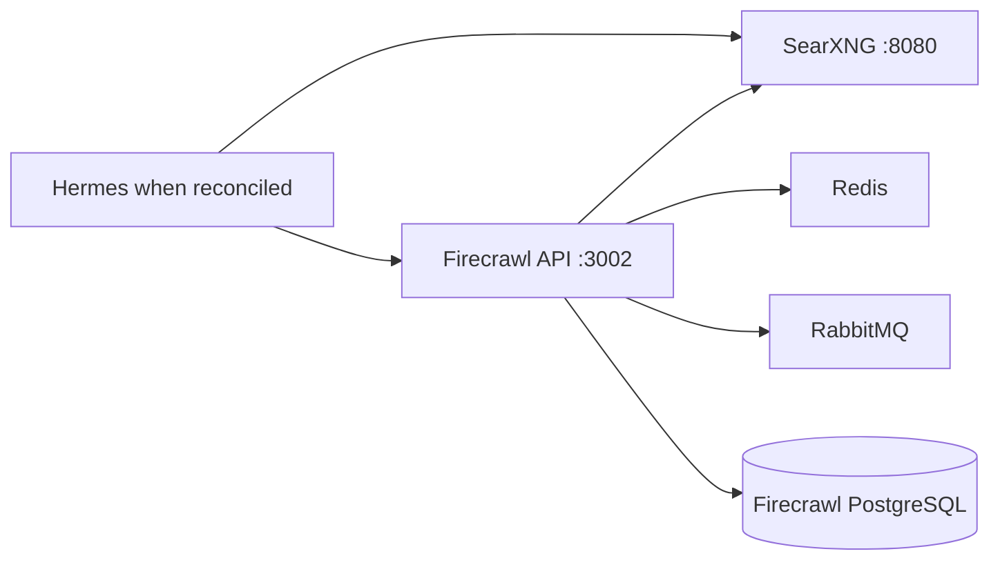

# Stack2 — SearXNG + Firecrawl

Stack2 is the local web-search and web-extraction provider. It is atomic, requires only Stack0, and provides `web.search` and `web.extract`.



No Stack2 application port is published directly to the host. SearXNG may be exposed by Stack1/HAProxy; Firecrawl and its supporting services remain internal to `redlocal`.

## Ownership

Stack2 owns:

```text
containers:
  searxng
  firecrawl-api
  firecrawl-playwright
  firecrawl-redis
  firecrawl-rabbitmq
  firecrawl-postgres

runtime:
  ${BASE_PATH}/service_-_searxng
  ${BASE_PATH}/service_-_firecrawl-redis
  ${BASE_PATH}/service_-_firecrawl-rabbitmq
  ${BASE_PATH}/service_-_firecrawl-postgres
```

Stack2 consumes `redlocal`; Stack0 owns and creates that network.

## Persistent state

```text
${BASE_PATH}/service_-_searxng/config
${BASE_PATH}/service_-_searxng/data
${BASE_PATH}/service_-_firecrawl-redis/data
${BASE_PATH}/service_-_firecrawl-rabbitmq/data
${BASE_PATH}/service_-_firecrawl-postgres/data
${BASE_PATH}/service_-_firecrawl-postgres/secret/postgres_admin_password
```

PREPARE preserves existing persistent directories. In particular, existing Firecrawl PostgreSQL PGDATA is never recursively chowned or permission-normalized by PREPARE. Existing inode, owner and mode belong to the PostgreSQL runtime and must be preserved.

## PostgreSQL security model

Stack2 uses one PostgreSQL cluster and one database named `postgres`, but two deliberately separate identities.

```text
firecrawl-postgres
└── database: postgres
    ├── postgres
    │   administrative/bootstrap role
    │   SUPERUSER
    │   owner of NUQ objects, extensions and pg_cron jobs
    │   password outside .env:
    │   ${BASE_PATH}/service_-_firecrawl-postgres/secret/postgres_admin_password
    │
    └── firecrawl
        application LOGIN role
        NOSUPERUSER
        NOCREATEDB
        NOCREATEROLE
        NOREPLICATION
        NOBYPASSRLS
        password: FIRECRAWL_DB_PASSWORD in protected operational .env
```

The database remains named `postgres` because the pinned upstream NuQ PostgreSQL image configures `pg_cron` for that database. Security separation is therefore implemented with roles, not by moving Firecrawl to another database.

`postgres` is reserved for bootstrap, ownership, extensions, cron and explicit administration. Firecrawl must not use it during normal runtime.

The application contract is:

```dotenv
FIRECRAWL_DB_NAME=postgres
FIRECRAWL_DB_USER=firecrawl
FIRECRAWL_DB_PASSWORD=<persistent application credential>
```

The administrative credential is intentionally absent from `.env`. On a fresh runtime, `01-prepare.sh` generates it once with restricted host permissions. Compose mounts it read-only into `firecrawl-postgres` and the official PostgreSQL entrypoint consumes it through `POSTGRES_PASSWORD_FILE`.

During first database initialization, upstream `010-nuq.sql` creates the NuQ schema/tables and Stack2's `config/postgres/020-firecrawl-app-role.sh` then provisions the dedicated Firecrawl role. It grants only the database/schema/table/sequence access required by the application and establishes matching default privileges for future NuQ objects created by `postgres`.

The bootstrap script is part of the clean installation path. Historical one-time migration helpers are deliberately not kept in the repository after the deployed platform has converged to this model.

## PostgreSQL network boundary

PostgreSQL does not publish port `5432` to the host.

```text
Firecrawl -> firecrawl-postgres:5432 on redlocal
```

For administrative work from the host, prefer bounded `docker exec` commands rather than publishing PostgreSQL to the LAN.

## Preparation and deployment

```bash
cd /opt/docker/stacks/stack2_-_searxng_firecrawl
sudo ./01-prepare.sh
docker compose up -d
sudo bash ./02-wait-ready.sh
docker compose ps
```

`01-prepare.sh`:

1. requires Stack0 PREPARE state;
2. validates the existing shared bridge network without creating it;
3. validates required `.env` variables;
4. prepares Stack2-owned runtime directories;
5. preserves existing PostgreSQL PGDATA metadata;
6. generates/preserves the PostgreSQL administrative runtime secret;
7. synchronizes managed SearXNG configuration;
8. validates Compose;
9. writes `.lock` only after successful preparation.

`.lock` means PREPARED only. It does not mean deployed, healthy or ready.

## Readiness

`docker compose up -d` establishes process state, but DEPLOYED is not READY. `02-wait-ready.sh` waits for both provider endpoints:

```text
web.search  -> searxng:8080
web.extract -> firecrawl-api:3002
```

The common installer uses this readiness gate after Stack2 deployment and during verification. Optional consumers are reconciled only after provider readiness succeeds.

## Internal endpoints

```text
SearXNG:        http://searxng:8080
Firecrawl API: http://firecrawl-api:3002
PostgreSQL:    firecrawl-postgres:5432
Redis:         firecrawl-redis:6379
RabbitMQ:      firecrawl-rabbitmq:5672
```

## Stack6 integration

Stack6 does not require Stack2. When Stack2 is absent or not ready, Hermes web tooling remains explicitly disabled.

Preferred incremental operation:

```bash
cd /opt/docker/stacks
sudo python3 install.py 2 --yes
```

If Stack2 transitions through deployment/recovery, the common installer waits for readiness and then discovers/reconciles prepared optional consumers through manifest capabilities. A healthy, already-ready Stack2 is verification-only and must not cause spurious Stack6 recreation.

Manual equivalent after restoring Stack2:

```bash
cd /opt/docker/stacks/stack2_-_searxng_firecrawl
sudo bash ./02-wait-ready.sh
cd /opt/docker/stacks/stack6_-_hermes
sudo ./06-reconcile-capabilities.sh --restart
```

## Re-preparation

Removing `.lock` is an explicit maintenance decision, not an upgrade mechanism. If PREPARE is deliberately repeated against an existing deployment, persistent directories, PostgreSQL PGDATA and generated runtime secrets must remain intact.

## Security invariants

- `postgres` is administrative only; Firecrawl runtime uses `firecrawl`.
- the PostgreSQL admin password lives outside `.env` and Git;
- `FIRECRAWL_DB_PASSWORD` is persistent and must not be rotated by editing `.env` alone;
- PostgreSQL is reachable only through the Docker network unless deliberately redesigned;
- PREPARE never resets or recursively repairs PGDATA;
- no migration helper is part of normal installation or routine convergence;
- absence of Stack2 must not create an external web fallback in consumers.
