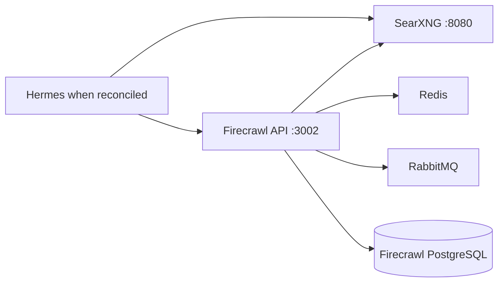
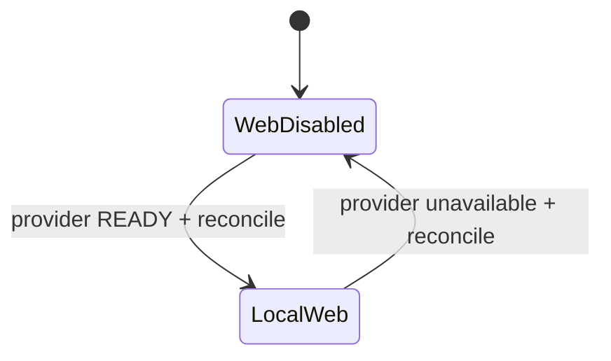

# Stack2 — SearXNG + Firecrawl

Stack2 is the local web search/extraction capability provider. It is atomic, requires only Stack0, and provides `web.search` and `web.extract`.



No Stack2 service publishes an application port directly to the host. SearXNG can be exposed through Stack1/HAProxy; Firecrawl and its supporting services remain internal to `redlocal`.

## Ownership

Stack2 owns six containers: SearXNG, Firecrawl API, Firecrawl Playwright, Redis, RabbitMQ and Firecrawl PostgreSQL. It also owns the corresponding SearXNG and Firecrawl runtime roots declared in its manifest.

It does **not** own `redlocal`; Stack0 creates/validates the shared network.

## Persistence

```text
${BASE_PATH}/service_-_searxng/config
${BASE_PATH}/service_-_searxng/data
${BASE_PATH}/service_-_firecrawl-redis/data
${BASE_PATH}/service_-_firecrawl-rabbitmq/data
${BASE_PATH}/service_-_firecrawl-postgres/data
${BASE_PATH}/service_-_firecrawl-postgres/secret/postgres_admin_password
```

PREPARE preserves the existing SearXNG configuration directory identity and persistent data directories. It synchronizes managed configuration without replacing a live bind-mounted directory.

Firecrawl PostgreSQL belongs only to Stack2. LiteLLM no longer uses this database in the current architecture.

Existing PostgreSQL `PGDATA` is never recursively chowned or permission-normalized by PREPARE. Its existing identity, owner and mode are preserved. A fresh empty PGDATA directory is initialized by the PostgreSQL container entrypoint.

## PostgreSQL identity model

Stack2 deliberately separates the PostgreSQL administrative identity from the Firecrawl application identity.

```text
firecrawl-postgres / database postgres
|
+-- postgres
|   admin/bootstrap role
|   owns NUQ/cron/extensions
|   password stored outside .env at:
|   ${BASE_PATH}/service_-_firecrawl-postgres/secret/postgres_admin_password
|
+-- firecrawl
    application role
    non-superuser / no CREATEDB / no CREATEROLE / no replication
    password: FIRECRAWL_DB_PASSWORD in the protected operational .env
    database: postgres
```

The database remains named `postgres` because the upstream NUQ image configures `pg_cron` against that database. The isolation boundary is therefore **role separation**, not a second database.

For a fresh runtime, Stack2 PREPARE generates the `postgres` administrative password once as a root-owned runtime secret. During first `initdb`, `config/postgres/020-firecrawl-app-role.sh` creates/reconciles the dedicated Firecrawl role after upstream `010-nuq.sql` has created the NUQ objects. Firecrawl receives CRUD access to the `nuq` schema but no PostgreSQL administrative privileges. Default privileges are configured so future NUQ tables/sequences created by `postgres` remain usable by the application role.

The application contract is:

```text
FIRECRAWL_DB_NAME=postgres
FIRECRAWL_DB_USER=firecrawl
FIRECRAWL_DB_PASSWORD=<persistent application password>
```

Firecrawl must not use the `postgres` role during normal operation.

### Existing deployments

Existing deployments created before this separation have `POSTGRES_PASSWORD` in the root operational `.env` and Firecrawl connects as `postgres`. They must be migrated explicitly; PREPARE does not silently mutate a live database identity.

After adding the new `FIRECRAWL_DB_*` variables to the protected operational `.env`, run:

```bash
sudo bash ./03-migrate-postgres-app-role.sh
```

The migration:

1. adopts the existing `POSTGRES_PASSWORD` once into the runtime administrative secret file without printing it;
2. creates/reconciles the dedicated Firecrawl role and minimum grants;
3. establishes default privileges for future NUQ objects;
4. validates that the role has no administrative attributes;
5. performs a TCP-authenticated SELECT/INSERT/UPDATE/DELETE probe inside a transaction and rolls it back;
6. does **not** modify PGDATA and does **not** restart/recreate containers.

Only after that migration passes should the new Compose definition be applied. The legacy `POSTGRES_USER`, `POSTGRES_PASSWORD` and `POSTGRES_DB` entries can then be removed from the operational `.env` after runtime validation confirms that Firecrawl is using `FIRECRAWL_DB_USER`.

## Preparation, deployment and readiness

```bash
cd /opt/docker/stacks/stack2_-_searxng_firecrawl
sudo ./01-prepare.sh
docker compose up -d
sudo bash ./02-wait-ready.sh
docker compose ps
```

PREPARE requires Stack0 `.lock`, verifies the existing shared bridge network without creating it, prepares stack-owned runtime paths/configuration, ensures the PostgreSQL administrative runtime secret exists, validates Compose and creates `.lock` only after success.

`.lock` means PREPARED, not deployed/healthy/ready.

`docker compose up -d` establishes process state, but **DEPLOYED is not READY**. `02-wait-ready.sh` waits up to its bounded timeout until both provider endpoints accept connections:

```text
web.search  -> searxng:8080
web.extract -> firecrawl-api:3002
```

The common installer runs this readiness gate after Stack2 deployment and again during Stack2 verification. Consumer reconciliation occurs only after the deploy-time readiness gate succeeds.

This behavior was validated by stopping only SearXNG and recovering Stack2 through the common installer: the same SearXNG container was restarted rather than recreated, readiness completed before Stack6 reconciliation, Hermes remained unchanged, and a second installer run returned to verification-only convergence.

## Internal endpoints

```text
SearXNG:        http://searxng:8080
Firecrawl API: http://firecrawl-api:3002
PostgreSQL:    firecrawl-postgres:5432
Redis:         firecrawl-redis:6379
RabbitMQ:      firecrawl-rabbitmq:5672
```

PostgreSQL does not publish `5432` to the host. Application access is through `redlocal`; administrative access from the host should normally use `docker exec` rather than exposing the database to the LAN.

## Stack6 integration

Stack6 does not require Stack2. Without a ready Stack2, Hermes web tools remain explicitly disabled.

Preferred incremental operation from repository root:

```bash
sudo python3 install.py 2 --yes
```

If Stack2 is already healthy/ready, this verifies it and does not spuriously reconcile Stack6. If Stack2 must actually deploy/recover, the common installer waits for provider readiness, discovers prepared consumers through manifest capabilities, and reconciles Stack6 automatically.

Manual equivalent after deploying/restoring Stack2:

```bash
sudo bash ./02-wait-ready.sh
cd /opt/docker/stacks/stack6_-_hermes
sudo ./06-reconcile-capabilities.sh --restart
```

Reconciliation enables web only when both provider containers are present on the configured shared network; the common installer additionally guarantees readiness before it invokes that reconciliation during a provider transition. Provider disappearance reverses the managed configuration to explicit web-disabled state when reconciled; it does not trigger an external web fallback.



## Re-preparation

```bash
rm .lock
sudo ./01-prepare.sh
```

Use this only when PREPARE itself must be repeated. Optional-capability activation in Stack6 uses reconciliation and does not require re-preparing Stack6.
