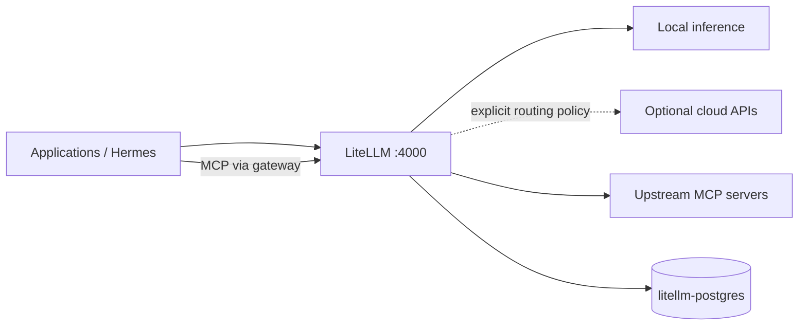
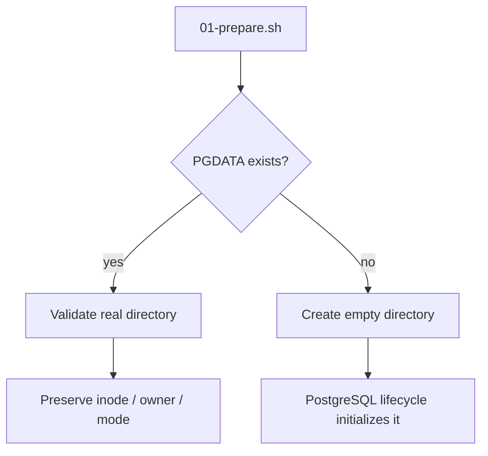

# Stack3 — LiteLLM + PostgreSQL

Stack3 is the AI model-policy and MCP gateway. It is atomic, requires only Stack0 and provides `ai.gateway` and `ai.mcp-gateway`.



Stack6 requires these two AI capabilities. Stack3 does not depend on Stack2.

## Ownership

```text
containers:
  litellm
  litellm-postgres

runtime:
  ${BASE_PATH}/service_-_litellm
  ${BASE_PATH}/service_-_litellm-postgres
```

Internal endpoints:

```text
http://litellm:4000
litellm-postgres:5432
```

Stack1 may expose LiteLLM through HAProxy, but Stack1 is optional from Stack3's dependency perspective.

## PostgreSQL identity model

Stack3 owns a dedicated PostgreSQL cluster. As with Stack2, administrative and application database identities are separated.

```text
litellm-postgres
├── postgres
│   administrative/bootstrap role
│   password outside .env:
│   ${BASE_PATH}/service_-_litellm-postgres/secret/postgres_admin_password
│
└── ${LITELLM_DB_USER}
    LiteLLM application role
    database: ${LITELLM_DB_NAME}
    password: LITELLM_DB_PASSWORD in protected operational .env
```

The `postgres` role is reserved for cluster administration/bootstrap. LiteLLM uses the dedicated application role in normal operation.

`LITELLM_SALT_KEY`, the LiteLLM database and both database credentials are persistent identities. They must not be regenerated during routine preparation or upgrades.

## PGDATA safety contract

The dedicated cluster lives at:

```text
${BASE_PATH}/service_-_litellm-postgres/data
```

PREPARE never changes owner/mode/inode of an existing PGDATA.



Do not use recursive `chown`, database resets or fresh-cluster recreation as routine configuration repair.

## Preparation and start

```bash
cd /opt/docker/stacks/stack3_-_litellm
sudo ./01-prepare.sh
sudo ./02-postgres.sh
docker compose up -d litellm
docker compose ps
```

`01-prepare.sh` requires Stack0, validates the shared network and environment, prepares/preserves Stack3-owned runtime, generates or preserves the PostgreSQL administrative runtime secret, synchronizes managed LiteLLM configuration, validates Compose and writes `.lock` only after success.

`02-postgres.sh` establishes/validates the dedicated PostgreSQL service and application database contract before LiteLLM is started.

`.lock` means PREPARED only. It is not a PostgreSQL or LiteLLM health signal.

Useful bounded database validation after maintenance:

```bash
docker exec litellm-postgres psql -U postgres -d postgres -Atc 'SELECT 1;'
docker exec litellm-postgres psql -U postgres -d postgres -v ON_ERROR_STOP=1 -c 'CHECKPOINT;'
```

## Re-preparation

Removing `.lock` is an explicit maintenance operation. If PREPARE is deliberately repeated against an existing deployment, PGDATA owner/mode/inode, database secrets, `LITELLM_SALT_KEY` and bind-directory identity must remain unchanged.

Historical migration helpers are not part of the current repository or installation path. The repository describes and deploys only the converged architecture.

## Security

Do not commit or rotate casually: `LITELLM_MASTER_KEY`, `LITELLM_SALT_KEY`, inference/MCP virtual keys, application database credentials or the PostgreSQL administrative runtime secret. Provider escalation belongs behind LiteLLM policy rather than being silently configured in consuming agents.
