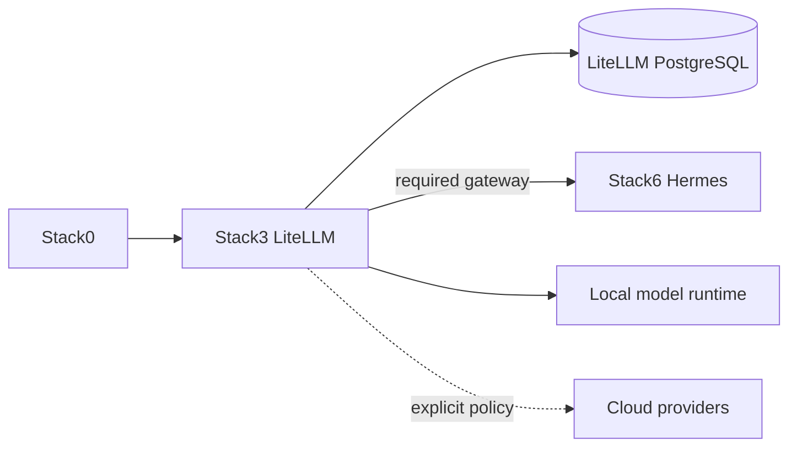

# Stack3 — LiteLLM

[Home](../README.md) · [Install](../INSTALLATION.md) · [DR](../bkp-dr/README.md) · [DR status](../bkp-dr/STATUS.md)

Stack3 is the inference/model-policy and MCP gateway. It requires Stack0 and is a required dependency of Stack6. It provides `ai.gateway` and `ai.mcp-gateway`.

PostgreSQL separates admin `postgres` from the configured LiteLLM application role. The admin password is a restricted runtime secret; `LITELLM_DB_PASSWORD` is the application credential. Existing PGDATA must not be reset/chowned recursively.

DR classification: **mixed**. Preserve a logical custom-format LiteLLM database dump plus the original `LITELLM_SALT_KEY` as protected external configuration. PostgreSQL admin credentials may be regenerated on clean rebuild. Real dependency-complete backup + temporary-database restore verification has passed; see [`../bkp-dr/STATUS.md`](../bkp-dr/STATUS.md).
