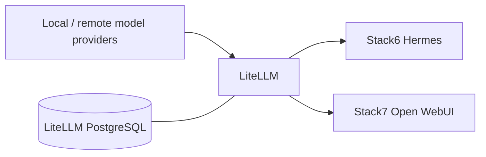

# Stack3 — LiteLLM

Central OpenAI-compatible inference gateway and model-policy boundary.

**Requires:** Stack0.  
**Provides:** `ai.gateway` and model/MCP gateway capabilities.  
**Required by:** Stack6 and Stack7.  
**DR:** logical PostgreSQL dump plus protected `LITELLM_SALT_KEY`; raw PGDATA is not backed up.

Applications use dedicated least-privilege virtual keys rather than the master key; see [../sdr/0003-least-privilege-ai-gateway-credentials.md](../sdr/0003-least-privilege-ai-gateway-credentials.md). MCP notes are in [mcp.md](mcp.md).
