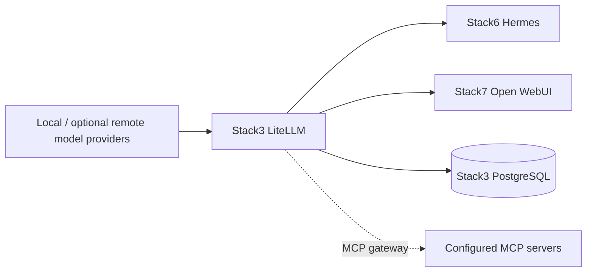
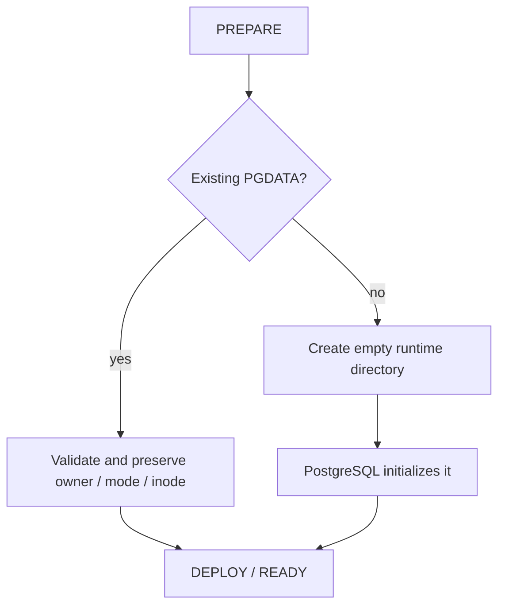

<!--
This Source Code Form is subject to the terms of the Mozilla Public
License, v. 2.0. If a copy of the MPL was not distributed with this
file, You can obtain one at https://mozilla.org/MPL/2.0/.
-->

# Stack3 — LiteLLM + PostgreSQL

[Documentation TOC](../docs/TOC.md) · [Stack map](../docs/stacks/README.md) · [OpenSpec contract](../docs/devel-docs/openspec/stacks/stack3.feature)

Stack3 is the central OpenAI-compatible AI gateway. It is the policy and credential boundary between local/remote model providers and application consumers such as Stack6 Hermes and Stack7 Open WebUI.

## Contract

- **Requires:** Stack0.
- **Provides:** `ai.gateway` and MCP/model gateway capabilities.
- **Required by:** Stack6 and Stack7.
- **DR:** logical PostgreSQL backup plus protected identity/configuration material; raw PGDATA is not the recovery artifact.

Stack3 does not depend on Stack2. Web search/extraction is a separate optional capability supplied by Stack2 and consumed by higher-level applications.

## PostgreSQL identity model

Stack3 owns a dedicated PostgreSQL cluster. Administrative bootstrap identity and LiteLLM application identity are deliberately separate:

- `postgres` is reserved for cluster bootstrap and administration. Its administrative password is stored in runtime secret storage outside the protected root `.env`.
- the configured LiteLLM database user is the application identity used during normal operation; its database name and credential are installation-owned persistent configuration.

`LITELLM_SALT_KEY`, database identity and persistent credentials are part of the installation identity. PREPARE and routine upgrades must preserve them rather than regenerate them.

## PGDATA contract

The Stack3 PostgreSQL data directory is runtime-owned state. PREPARE validates and preserves an existing PGDATA directory; it must not recursively change owner/mode, replace its inode, reset the database or recreate the cluster as a routine configuration repair.

`.lock` means **PREPARED only**. It is not proof that PostgreSQL or LiteLLM is running or healthy.

## Credential and policy boundary

Application consumers use dedicated least-privilege virtual credentials rather than `LITELLM_MASTER_KEY`. Provider policy also stays behind LiteLLM: consumers should not bypass the gateway to reach model providers directly.

MCP traffic follows the same boundary when routed through LiteLLM. See the operator integration documentation for supported MCP configuration rather than coupling applications to internal implementation files.

## Security invariants

- Administrative PostgreSQL credentials remain outside Git and outside the root `.env`.
- LiteLLM consumers receive scoped credentials instead of the master key.
- Persistent identity material is preserved across PREPARE and guarded upgrades.
- Applications consume the gateway rather than embedding provider credentials or provider-selection policy.
- `./local-ai` is the supported management boundary; direct stack scripts and Compose commands are implementation details.

## Related decisions

- [SDR-0003 — least-privilege AI gateway credentials](../docs/devel-docs/sdr/0003-least-privilege-ai-gateway-credentials.md)
- [ADR-0004 — upgrade compatibility policy](../docs/devel-docs/adr/0004-upgrade-compatibility-policy.md)
- [LiteLLM MCP integration](../docs/user-docs/integrations/litellm-mcp.md)
- [PostgreSQL disaster recovery](../docs/dr/postgres.md)

Key implementation files: `docker-compose.yml`, `config/litellm/config.yaml`, `manifest.json`, and stack lifecycle scripts.
