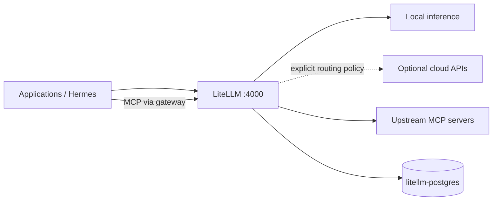
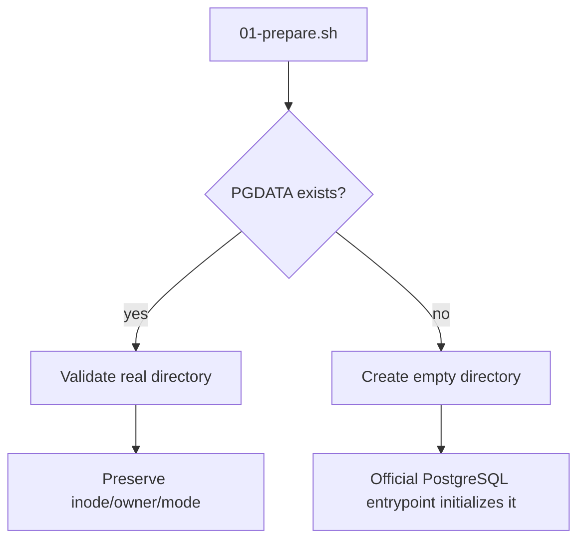

# Stack3 — LiteLLM + PostgreSQL

Stack3 is the AI model-policy and MCP gateway. It is atomic, requires only Stack0 and provides `ai.gateway` and `ai.mcp-gateway`.



Stack6 requires these two AI capabilities; Stack3 itself does not require Stack2.

## Ownership

```text
container: litellm
container: litellm-postgres
runtime:   ${BASE_PATH}/service_-_litellm
runtime:   ${BASE_PATH}/service_-_litellm-postgres
```

Internal endpoints:

```text
http://litellm:4000
litellm-postgres:5432
```

Stack1 may expose LiteLLM through HAProxy, but Stack1 is optional from Stack3's dependency perspective.

## Persistent identity

The dedicated PostgreSQL cluster lives at:

```text
${BASE_PATH}/service_-_litellm-postgres/data
```

The PostgreSQL administrative password is generated once into Stack3 runtime secret state. `LITELLM_DB_*` identifies the LiteLLM application database/user. `LITELLM_SALT_KEY` must remain stable once encrypted LiteLLM state exists.

## PGDATA safety contract

PREPARE must never change owner/mode of an existing PGDATA. Existing directory identity, ownership and permissions are preserved.



This prevents a running bind-mounted PostgreSQL cluster from becoming inaccessible due to host-side ownership changes. Do not use recursive `chown` as a routine repair of an existing database tree.

## Preparation and start

```bash
cd /opt/docker/stacks/stack3_-_litellm
sudo ./01-prepare.sh
sudo ./02-postgres.sh
docker compose up -d litellm
docker compose ps
```

`01-prepare.sh` requires Stack0, verifies the shared network, preserves existing PGDATA, preserves/generates the administrative secret, preserves the LiteLLM config bind-directory identity, synchronizes managed `config.yaml`, validates Compose and creates `.lock`.

`02-postgres.sh` starts/validates the dedicated PostgreSQL service. `.lock` means PREPARED only; it is not a PostgreSQL or LiteLLM health signal.

Useful database validation after maintenance:

```bash
docker exec litellm-postgres psql -U postgres -d postgres -Atc 'SELECT 1;'
docker exec litellm-postgres psql -U postgres -d postgres -v ON_ERROR_STOP=1 -c 'CHECKPOINT;'
```

## Legacy migration

`90-migrate-postgres-from-stack2.sh` exists only for deployments created before Stack3 became atomic. It migrates LiteLLM state from the former shared Firecrawl PostgreSQL into `litellm-postgres` while retaining rollback material.

It is **not** part of a clean install and must not be rerun after a successful migration. Do not delete the legacy database/rollback dump until its rollback window has been deliberately closed.

## Re-preparation

Removing `.lock` is an explicit maintenance operation. When PREPARE is deliberately repeated against an existing deployment, PGDATA owner/mode/inode, database secret and bind-directory identity must remain unchanged.

## Security

Do not commit or rotate casually: `LITELLM_MASTER_KEY`, `LITELLM_SALT_KEY`, inference/MCP virtual keys, database credentials or the PostgreSQL administrative secret. Provider escalation belongs behind LiteLLM policy rather than being silently configured in consuming agents.
