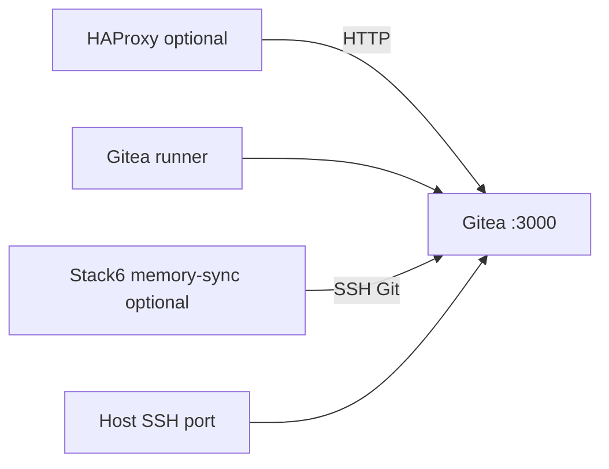

# Stack4 — Gitea + Runner

Stack4 provides local Git infrastructure. It is atomic, requires only Stack0 and provides `git.remote` and `git.runner`.



Gitea serves HTTP inside `redlocal`; Stack1 may provide public HTTPS. Built-in Git SSH is published directly on the configured host port.

## Ownership

Stack4 owns containers `gitea` and `gitea-runner`, runtimes `service_-_gitea` and `service_-_gitea-runner`, Gitea data/configuration, runner `.runner` identity and the runtime-owned registration secret.

Stack0 owns the shared network. Stack4 verifies it and never creates it.

## Runner secret lifecycle

The registration token is persistent runtime state during normal operation:

```text
${BASE_PATH}/service_-_gitea-runner/secret/registration-token
```

It is not part of the permanent `.env` contract. PREPARE preserves an existing token, may adopt the former legacy environment value once, or generates/persists one for a fresh deployment. Containers receive the secret through a mounted file path rather than the token value in their environment.

Persistent Gitea secrets such as `GITEA_INTERNAL_TOKEN` and `GITEA_JWT_SECRET` must not be rotated accidentally.

For full DR, the runner token/identity is reconstructable and may be re-registered after Gitea is restored. It is not a core recovery artifact.

## Configuration layout

Managed source files are `config/gitea/app.ini` and `config/gitea-runner/config.yaml`. PREPARE renders runtime configuration while preserving bind-directory identity. The Gitea custom configuration path is explicitly aligned so web and SSH/subprocess operations resolve the same `app.ini`.

## Preparation and deployment

```bash
cd /opt/docker/stacks/stack4_-_gitea
sudo ./01-prepare.sh
sudo ./02-run.sh
```

`01-prepare.sh` validates Stack0/network, prepares/preserves the registration secret and runtime directories, renders managed configuration, validates Compose and creates `.lock`.

`02-run.sh` requires `.lock`, pulls images, runs Gitea migrations, ensures the configured administrator, starts Gitea/runner and verifies the runner identity.

`.lock` means PREPARED only.

## Disaster recovery

Gitea is a managed DR domain. Preserve the complete logical/application state required to recover repositories and associated metadata with an application-aware native Gitea dump. Do not reduce the contract to selected filesystem paths such as only `gitea.db` or only `git/repositories`.

Target manifest semantics:

```json
{
  "recovery": {
    "contract": {
      "schema_version": 1,
      "mode": "managed"
    },
    "resources": [
      {
        "id": "gitea-state",
        "class": "persistent-data",
        "strategy": "gitea-native-dump",
        "sensitive": true,
        "config": {
          "source": {
            "type": "application",
            "service": "gitea"
          },
          "restore": {
            "phase": "post-prepare-pre-deploy"
          }
        }
      }
    ]
  }
}
```

The future recovery engine must verify the exact native dump/restore command and flags against the deployed Gitea version before implementation. See [`../dr-howto.md`](../dr-howto.md) and [`../recovery.schema.json`](../recovery.schema.json).

## Stack6 Git-memory capability

Stack6 treats `git.remote` as optional. Merely installing Stack4 does not automatically enable Git-memory synchronization.

After Git memory has been safely adopted (`04-gitmem.sh`) and dedicated SSH material validated (`05-maintenance-sidecars.sh`), operator intent is enabled with:

```bash
cd /opt/docker/stacks/stack6_-_hermes
sudo ./06-reconcile-capabilities.sh --enable-git-memory
```

If Gitea later becomes unavailable, reconciliation stops only the memory-sync sidecar and preserves memory/Git state and desired intent. It does not merge, rebase or force-push.

## Normal operation

```bash
docker compose up -d
docker compose restart gitea
docker compose logs -f
```

Avoid `docker compose down -v`; persistent state/identity must not be coupled to routine shutdown.

## Re-preparation

```bash
rm .lock
sudo ./01-prepare.sh
sudo ./02-run.sh
```

Use deliberately. Existing Gitea data, runner identity and registration token must remain preserved during normal maintenance even though runner identity is reconstructable in full DR.
