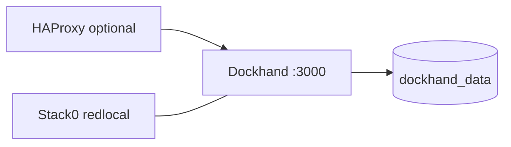

# Stack5 — Dockhand

Stack5 provides container-management tooling. It is atomic, requires only Stack0 and provides `containers.management`.



Dockhand exposes port 3000 only inside Docker; Stack1 may publish it through HAProxy.

## Ownership

Stack5 owns:

```text
container:dockhand
volume:dockhand_data
```

`dockhand_data` is an external Docker volume and is the stack's persistent operational state. There is intentionally no `${BASE_PATH}/service_-_dockhand` directory.

Stack0 owns the shared network. Stack5 validates that network and does not create it.

## Volume lifecycle

PREPARE treats `dockhand_data` conservatively during normal operation:

- existing volume: preserve unchanged;
- missing volume: create once;
- never delete/recreate an existing volume during PREPARE;
- keep Compose declaration `external: true` so routine project shutdown does not own its lifecycle.

Persistent storage does **not** imply DR value. Dockhand is a container visualizer/management UI and is intentionally reconstructable after total loss.

## Preparation and startup

```bash
cd /opt/docker/stacks/stack5_-_dockhand
sudo ./01-prepare.sh
docker compose up -d
docker compose ps
```

PREPARE requires Stack0 `.lock`, validates stack location/shared network, ensures the external volume exists, validates Compose and creates `.lock` after success.

`.lock` means PREPARED only.

## Disaster recovery

Target manifest semantics:

```json
{
  "recovery": {
    "contract": {
      "schema_version": 1,
      "mode": "reconstructable"
    }
  }
}
```

`dockhand_data` is **not** a recovery target. A disaster rebuild may create a fresh Dockhand volume and redeploy the stack from source/configuration.

See [`../dr-howto.md`](../dr-howto.md) and [`../recovery.schema.json`](../recovery.schema.json).

## Re-preparation

```bash
rm .lock
sudo ./01-prepare.sh
```

This must preserve `dockhand_data` during normal maintenance. Do not use `docker compose down -v`, `docker volume prune` or general cleanup operations as part of normal Stack5 maintenance.

## Security boundary

Dockhand is container-management infrastructure and should be exposed only through the intended trusted ingress/network boundary. Operational credentials and Docker/runtime state never belong in Git.
