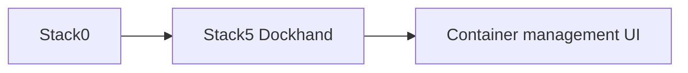

# Stack5 — Dockhand

[Home](../README.md) · [Install](../INSTALLATION.md) · [DR](../bkp-dr/README.md) · [Pending](../pending.md)

Stack5 owns the Dockhand container-management UI and requires Stack0.

DR classification: **reconstructable**. The existence of persistent Docker storage such as `dockhand_data` does not by itself make it a recovery artifact. Do not add it to backups merely because it is persistent.

Use [`manifest.json`](manifest.json), Compose configuration and lifecycle scripts as executable truth.
