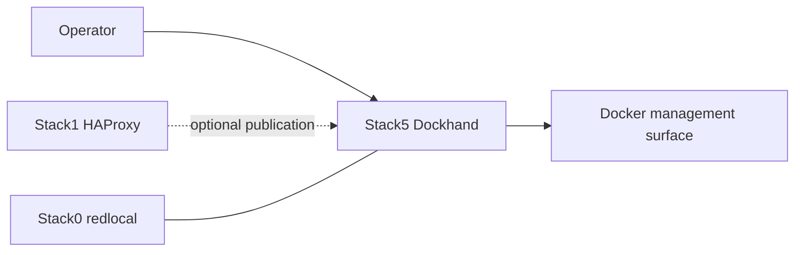

# Stack5 — Dockhand

[Documentation TOC](../docs/TOC.md) · [Stack map](../docs/stacks/README.md) · [OpenSpec contract](../docs/devel-docs/openspec/stacks/stack5.feature)

Stack5 provides the Dockhand container-management UI. It is an operational convenience surface, not part of the AI request path and not a required dependency of other application stacks.

## Contract

- **Requires:** Stack0.
- **Optional relation:** Stack1 may publish the UI.
- **Owns:** the `dockhand` container and external Docker volume `dockhand_data`.
- **DR:** reconstructable; Dockhand application state is not a recovery target.
- **Purpose:** operational convenience, not a control-plane dependency of `./local-ai`.

Dockhand persists through the existing external Docker volume `dockhand_data`; there is intentionally no Stack5 bind-mounted `service_-_dockhand` runtime directory. PREPARE validates the external volume contract but does not create, migrate or rewrite its contents.

`.lock` means **PREPARED only**. It does not mean the Dockhand container is running or healthy.

## Lifecycle behaviour

The supported operator lifecycle is `./local-ai start 5` / `./local-ai stop 5` and the common install/upgrade paths. Selective stop uses Compose stop semantics: the existing container is preserved rather than removed or recreated. This behaviour has been runtime-qualified on m92p.

Dockhand must not become a hidden prerequisite for platform management. `./local-ai` remains authoritative even if Stack5 is absent or stopped.

## Security invariants

- Stack5's Docker-management capability is intentionally separate from agent stacks; Hermes does not receive a Docker socket through Stack5.
- The external volume is runtime-owned and not rewritten during PREPARE.
- Stack5 does not define the platform management contract; `./local-ai` does.

## Related decisions

- [ADR-0002 — single management CLI](../docs/devel-docs/adr/0002-single-management-cli.md)
- [SDR-0002 — agent runtime without Docker socket](../docs/devel-docs/sdr/0002-agent-runtime-without-docker-socket.md)
- [CLI reference: start / stop](../docs/user-docs/cli.md)

Key implementation files: `docker-compose.yml`, `manifest.json`, and the stack-owned PREPARE script.
