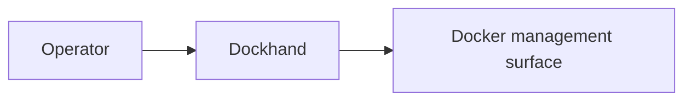

# Stack5 — Dockhand

Container-management UI for the local platform.

**Requires:** Stack0.  
**DR:** reconstructable; Dockhand runtime state is not a recovery target.  
**Purpose:** operational convenience, not a dependency of the AI data path.

The common installer owns deployment; no tests live inside this stack.
