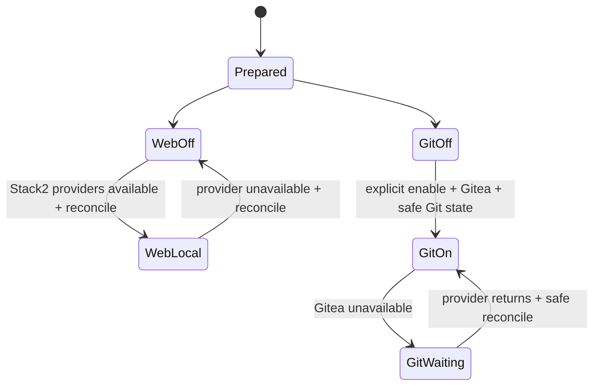
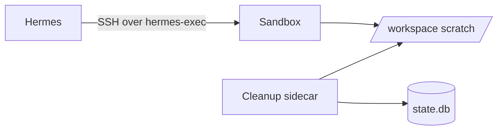

# Stack6 — Hermes Agent

Stack6 is the agent/orchestration layer. It is atomic and requires Stack0 + Stack3. Stack2 and Stack4 are optional capability providers.

Manifest contract:

```text
requires:          platform foundation + Stack3
consumes:          ai.gateway, ai.mcp-gateway
optional_consumes: web.search, web.extract, git.remote
provides:          ai.agent, ai.sandbox, ai.memory
```

## Architecture

```mermaid
flowchart TB
    U[User] --> H[Hermes]
    TG[Telegram optional] -.-> H
    BZ[Buzz optional] -.-> H
    H -->|inference + MCP| LL[Stack3 LiteLLM]
    H -. optional local web .-> SX[Stack2 SearXNG]
    H -. optional local extract .-> FC[Stack2 Firecrawl]
    H -->|SSH| SB[hermes-sandbox]
    H --> MEM[Git-backed memory]
    MS[hermes-memory-sync] --> MEM
    MS -. optional git.remote .-> G[Stack4 Gitea]
    CLEAN[hermes-sandbox-cleanup] --> SB
```

Hermes owns intelligent work and native deferred scheduling. Deterministic sidecars own mechanical memory synchronization and sandbox cleanup.

## Services and security boundaries

| Service | Network | Persistent state | Purpose |
|---|---|---|---|
| `hermes` | `redlocal` + `hermes-exec` | Hermes runtime + memory mount | agent, tools, messaging, native Cron |
| `hermes-sandbox` | `hermes-exec` only | sandbox home/workspace/state | isolated SSH execution |
| `hermes-memory-sync` | `redlocal` | memory worktree + dedicated SSH identity | conservative Git sync |
| `hermes-sandbox-cleanup` | none | sandbox workspace + lifecycle DB | retention/quarantine/cleanup |

No Stack6 service receives the Docker socket or privileged mode. The sandbox is not attached to `redlocal`.

## PREPARE

```bash
cd /opt/docker/stacks/stack6_-_hermes
sudo ./01-prepare.sh
```

PREPARE requires Stack0 and Stack3 locks, validates mandatory provider configuration, prepares Stack6-owned runtime/configuration and creates `.lock` after success. It does **not** require Stack2 or Stack4.

`.lock` means PREPARED only.

Telegram and Buzz are optional. Empty credentials mean disabled. They are not required for the core Hermes -> LiteLLM path.

## Capability reconciliation

Optional capabilities are managed after preparation by `06-reconcile-capabilities.sh`.



### Web

Managed source defaults to `disabled_toolsets: [web]`. This is deliberate: removing local provider configuration alone could allow undesired fallback behavior.

When both `searxng` and `firecrawl-api` are running on `redlocal`, reconciliation renders web enabled. If either disappears, reconciliation renders web disabled again.

```bash
sudo ./06-reconcile-capabilities.sh --restart
```

`--restart` recreates only Hermes when its managed config actually changes and Hermes is already running.

### Git memory desired state

Git memory has persistent operator intent under the memory-sync runtime. A new deployment defaults to disabled.

```bash
sudo ./06-reconcile-capabilities.sh --enable-git-memory
sudo ./06-reconcile-capabilities.sh --disable-git-memory
```

Without either flag, existing intent is preserved. Provider availability alone never enables Git memory.

If enabled but Gitea is unavailable, only `hermes-memory-sync` is stopped; local memory/Git state and desired intent are preserved.

Reconciliation never creates providers, adopts/clones memory, commits, pushes, pulls, merges, rebases or changes `.env`/`.lock`.

## Git-backed memory

```text
${BASE_PATH}/service_-_hermes-memory/data/
├── .git/
├── MEMORY.md
└── USER.md
```

`04-gitmem.sh` is the bounded adoption/validation step. It permits additional static tracked files, but only `MEMORY.md` and `USER.md` are mutable memory files for automatic synchronization.

Dedicated sync SSH material:

```text
${BASE_PATH}/service_-_hermes-memory-sync/ssh/
├── id_ed25519
├── known_hosts
└── ssh_config
```

`05-maintenance-sidecars.sh` validates this material; it does not create/replace credentials.

The sync sidecar is conservative: fetch before decisions, fast-forward only for clean remote-ahead state, commit/push valid local memory changes, refuse divergence, never force-push, verify local/remote equality after success.

## Sandbox execution



The workspace is scratch, not durable storage. Anything needed by later work must be persisted elsewhere before the current run ends.

Generation integrity is represented by both:

```text
${BASE_PATH}/service_-_hermes-sandbox/data/workspace/.sandbox-generation
${BASE_PATH}/service_-_hermes-sandbox/data/state/state.db
```

Marker and SQLite generation must match. Startup fails closed on missing/corrupt/mismatched lifecycle state.

## Sandbox cleanup

`hermes-sandbox-cleanup` has `network_mode: none`. It watches activity, reconciles top-level objects, protects the baseline, quarantines inactive post-baseline objects and deletes them after the grace period while retaining audit state according to policy.

Defaults:

```dotenv
SANDBOX_CLEANUP_RETENTION_DAYS=7
SANDBOX_CLEANUP_QUARANTINE_DAYS=1
SANDBOX_CLEANUP_DB_RETENTION_DAYS=90
SANDBOX_CLEANUP_SWEEP_HOUR=3
SANDBOX_CLEANUP_SWEEP_MINUTE=30
```

## Bounded sandbox recovery

```bash
cd /opt/docker/stacks/stack6_-_hermes
docker compose stop hermes hermes-sandbox hermes-sandbox-cleanup
sudo ./02-cleanup.sh --reset-sandbox --yes
docker compose up -d hermes-sandbox hermes hermes-sandbox-cleanup
```

This resets workspace/lifecycle state only. It preserves Hermes runtime/session/auth state, Git memory, sandbox home/authorized keys, sandbox host identity, managed configuration and memory-sync SSH identity. It does not require removing Stack6 `.lock`.

## Native Cron

Deferred intelligent work uses Hermes native Cron; there is no standalone scheduler stack. Cron runs are fresh agent sessions, so scheduled prompts must be self-contained and reference durable inputs rather than transient sandbox files or the conversation that created the job.

## Deployment sequence

```bash
cd /opt/docker/stacks/stack6_-_hermes
sudo ./01-prepare.sh
sudo ./04-gitmem.sh
sudo ./05-maintenance-sidecars.sh
sudo ./03-temporary-fix-issue-74116-terminal-timeout.sh
docker compose config --quiet
docker compose up -d --build
sudo ./06-reconcile-capabilities.sh --restart
docker compose ps
```

The terminal-timeout workaround is retained for the validated Hermes `v2026.8.31` deployment while required.

## Validated boundaries

The reference deployment has exercised Hermes -> LiteLLM, LiteLLM authentication/local inference, Hermes -> SSH sandbox, incremental web enable/disable, Git-memory desired-state/provider-loss/provider-return behavior, memory-sync -> Gitea, native Cron, sandbox generation persistence, cleanup/quarantine and bounded sandbox reset.

Do not commit operational `.env`, private SSH keys, Hermes/LiteLLM/Telegram/Buzz credentials, runtime databases or lifecycle state.
